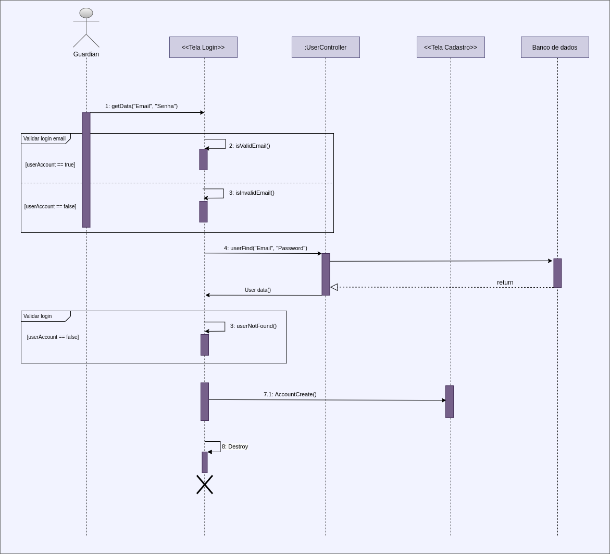

## Introdução
### Objetivo
&emsp;&emsp;O presente documento de arquitetura tem como objetivo elucidar e descrever os aspectos mais importantes no que tange os estilos e padrões arquiteturais acerca da concepção e desenvolvimento do projeto Curumim.

### Escopo
&emsp;&emsp;Através desse documento é possível se ter um entendimento detalhado sobre sobre os aspectos inerentes ao projetos contidos no conjunto "4 + 1" de visões arquiteturais definido pelo RUP[[1]](#bibliografia) e a visão de dados. 
&emsp;&emsp;Além disso, esse documento aborda uma representação mais detalhada da arquitetura, as metas arquiteturais, restrições e aspectos acerca da qualidade, tamanho e desempenho do produto 
&emsp;&emsp;Sendo assim, esse documento serve de guia para o entendimento do design e desenvolvimento do projeto.

### Definições, Acrônimos e Abreviações
&emsp;&emsp;A tabela a seguir contém as definições dos mais variados termos utilizados neste documento de arquitetura. Mais definições sobre termos pertencentes ao domínio do projeto podem ser encontrados no documento de [***Léxicos***](../../base/requisitos/modelagem/lexicos).

| Termo | Descrição |
| :-: | -- |
| RUP | Rational Unified Process |

### Visão geral
&emsp;&emsp;Esse documento de arquitetura é composto pelos seguintes tópicos:

 - [Introdução](#introducao): Provê uma visão ampla sobre o presente documento.
 - [Representação da arquitetura](#representacao-da-arquitetura): Descreve e representa a arquitetura escolhida para o projeto;
 - [Metas Arquiteturais e Restrições](#metas-arquiteturais-e-restrições): Descreve as metas arquiteturais e as restrições que têm impacto significativo na arquitetura;
 - [Visão de Casos de Uso](#visao-de-casos-de-uso): Descreve e detalha os casos de uso;
 - [Visão Lógica](#visao-logica): Descreve as partes arquitetonicamente significativas do modelo de projeto;
 - [Visão de Processos](#visao-de-processos): Descreve a decomposição do sistema em processos menores e seus agrupamentos;
 - [Visão de Implantação](#visao-de-implantacao): Descreve a disponibilização da aplicação para uso;
 - [Visão de Implementação](#visao-de-implementacao): Descreve a estrutura e decomposição do modelo de implementação do projeto;
 - [Visão de Dados](#visao-de-dados): Descreve a persistência de dados armazenados;
 - [Tamanho e Desempenho](#tamanho-e-desempenho): Descreve as principais características de dimensionamento afetam a arquitetura, bem como as restrições de desempenho;
 - [Qualidade](#qualidade): Descreve como a arquitetura contribui com as mais variadas características de qualidade.
 - [Bibliografia](#bibliografia): Fontes utilizadas para a construção desse artefato;
 - [Versionamento](#versionamento): Histórico de alterações do documento.

## Representação da arquitetura

## Metas Arquiteturais e Restrições

## Visão de Casos de Uso

## Visão Lógica

## Visão de Processos

&emsp;&emsp;A visão de Processo evidencia as ações processadas pelo sistema em tempo de execução, além da alocação de objetos e classes para tarefas. É uma visão que permite a visualização das partes dinâmicas do sistema, onde é evidenciado os processos, as threads e as interações entre elas. 
### Diagrama de Sequência

&emsp;&emsp;O diagrama de sequência é uma solução dinâmica de modelagem em UML bastante utilizada para demonstrar um conjunto de interações entre os componentes de um sistema. Em nossa implementação utilizamos de alguns [diagramas de sequência](../modelagem/modelagem-dinamica/diagrama-de-sequencia.md) para mostrar alguns processos de nosso sistema.

### [Administrador](../../../base/requisitos/modelagem/lexicos/#lexico-administrador) cadastrando [Professor](../../../base/requisitos/modelagem/lexicos/#lexico-professor)

[Figura x: Diagrama de sequência do administrador cadastrando professor](../assets/imagens/diagrama-de-sequencia/Diagrama-de-sequencia-admin-cadastrando-prof.png)

### [Administrador](../../../base/requisitos/modelagem/lexicos/#lexico-administrador) cadastrando [Evento](../../../base/requisitos/modelagem/lexicos/#lexico-evento)

[Figura x: Diagrama de sequência do administrador cadastrando evento](../assets/imagens/diagrama-de-sequencia/../../../assets/imagens/diagrama-de-sequencia/Diagrama-de-sequencia-admin-cadastrando-evento.png)

### [Guardian](../../../base/requisitos/modelagem/lexicos/#lexico-responsavel) fazendo Login

[Figura x: Diagrama de sequência do guardian fazendo login](../assets/imagens/diagrama-de-sequencia/Diagrama-de-sequencia-pais-responsaveis-login.png)

## Visão de Implantação

## Visão de Implementação

## Visão de Dados

## Tamanho e Desempenho

## Qualidade

## Bibliografia

> - [1] Visões Arquiteturais. Disponível em <https://www.inf.ufpr.br/andrey/ci163/VisoesAl.pdf>. Acesso em 29 set. 2021.

> - [2] Documento de Arquitetura de Software. Disponível em <https://www.cin.ufpe.br/~gta/rup-vc/core.base_rup/guidances/guidelines/software_architecture_document_F4C93435.html>. Acesso em: 04 de out. de 2021.    

## Versionamento

| Versão | Data | Modificação | Autor |
|:-:|--|--|--|
|1.0|29/09/2021| Abertura do documento e inclusão da introdução | Daniel Porto |
|1.1|04/10/2021| Adição da Visão de Processos | João Pedro, Enzo Gabriel |
