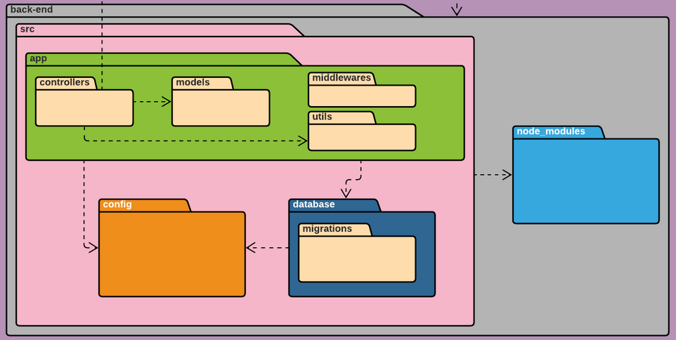
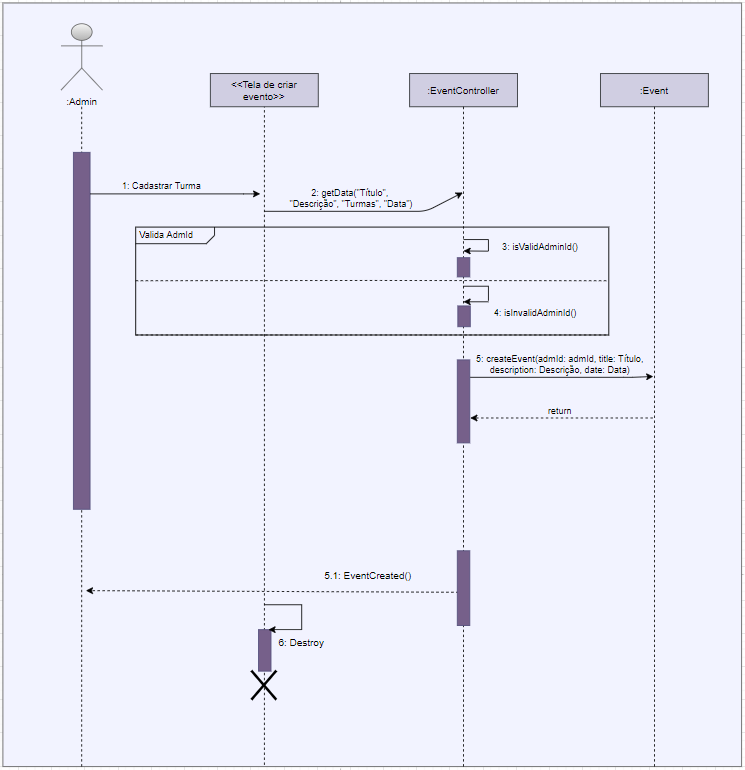
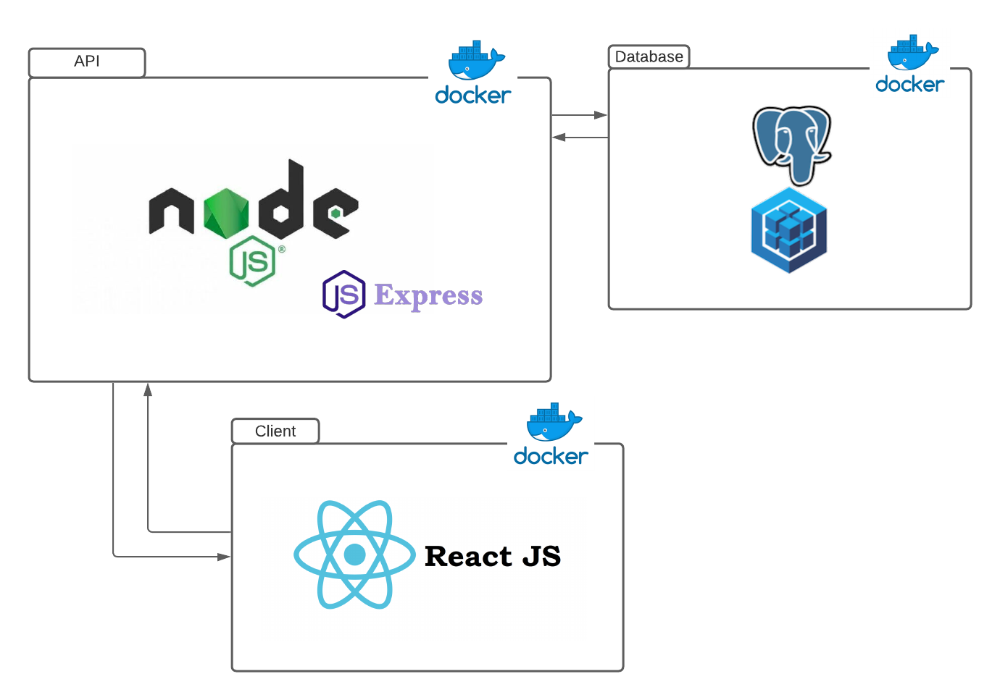

## Introdução
### Objetivo
&emsp;&emsp;O presente documento de arquitetura tem como objetivo elucidar e descrever os aspectos mais importantes no que tange os estilos e padrões arquiteturais acerca da concepção e desenvolvimento do projeto Curumim.

### Escopo
&emsp;&emsp;Através desse documento é possível se ter um entendimento detalhado sobre os aspectos inerentes ao projetos contidos no conjunto "4 + 1" de visões arquiteturais definido pelo RUP[[1]](#bibliografia) e a visão de dados. 
&emsp;&emsp;Além disso, esse documento aborda uma representação mais detalhada da arquitetura, as metas arquiteturais, restrições e aspectos acerca da qualidade, tamanho e desempenho do produto 
&emsp;&emsp;Sendo assim, esse documento serve de guia para o entendimento do design e desenvolvimento do projeto.

### Definições, Acrônimos e Abreviações
&emsp;&emsp;A tabela a seguir contém as definições dos mais variados termos utilizados neste documento de arquitetura. Mais definições sobre termos pertencentes ao domínio do projeto podem ser encontrados no documento de [***Léxicos***](../../base/requisitos/modelagem/lexicos).

| Termo | Descrição |
| :-: | -- |
| RUP | Rational Unified Process |
| MVC | Model View Controller |

### Visão geral
&emsp;&emsp;Esse documento de arquitetura é composto pelos seguintes tópicos:

 - [Introdução](#introducao): Provê uma visão ampla sobre o presente documento.
 - [Representação da arquitetura](#representacao-da-arquitetura): Descreve e representa a arquitetura escolhida para o projeto;
 - [Metas Arquiteturais e Restrições](#metas-arquiteturais-e-restrições): Descreve as metas arquiteturais e as restrições que têm impacto significativo na arquitetura;
 - [Visão de Casos de Uso](#visao-de-casos-de-uso): Descreve e detalha os casos de uso;
 - [Visão Lógica](#visao-logica): Descreve as partes arquitetonicamente significativas do modelo de projeto;
 - [Visão de Processos](#visao-de-processos): Descreve a decomposição do sistema em processos menores e seus agrupamentos;
 - [Visão de Implantação](#visao-de-implantacao): Descreve a disponibilização da aplicação para uso;
 - [Visão de Implementação](#visao-de-implementacao): Descreve a estrutura e decomposição do modelo de implementação do projeto;
 - [Visão de Dados](#visao-de-dados): Descreve a persistência de dados armazenados;
 - [Tamanho e Desempenho](#tamanho-e-desempenho): Descreve as principais características de dimensionamento afetam a arquitetura, bem como as restrições de desempenho;
 - [Qualidade](#qualidade): Descreve como a arquitetura contribui com as mais variadas características de qualidade.
 - [Bibliografia](#bibliografia): Fontes utilizadas para a construção desse artefato;
 - [Versionamento](#versionamento): Histórico de alterações do documento.

## Representação da arquitetura

## Metas Arquiteturais e Restrições

## Visão de Casos de Uso
&emsp;&emsp;Apresentando uma representação mais próxima do usuário, a visão de casos de uso auxilia no entendimento das interações dos atores com o sistema de forma a descrever os cenários de uso da aplicação. O diagrama de casos de uso do projeto Curumim pode ser acessado pelo [documento de casos de uso](../../modelagem/modelagem-dinamica/casos-de-uso) desenvolvido anteriormente. 
&emsp;&emsp;A seguir, tem-se uma descrição resumida dos casos de uso mais significativos do projeto, os quais contemplam as funcionalidades mais prioritárias do sistema.
#### Descrição dos casos de uso mais significativos

- **UC01 - Cadastrar [criança](../../base/requisitos/modelagem/lexicos/#lexico-crianca):** este caso de uso é exclusivo do ator [administrador](../../base/requisitos/modelagem/lexicos/#lexico-administrador) e consiste em registrar uma [criança](../../base/requisitos/modelagem/lexicos/#lexico-crianca) dentro do sistema da aplicação com o objetivo de colocá-la no banco de dados, tornando essa [criança](../../base/requisitos/modelagem/lexicos/#lexico-crianca) uma [aluna](../../base/requisitos/modelagem/lexicos/#lexico-aluno) no [centro educacional](../../base/requisitos/modelagem/lexicos/#lexico-centro-educacional).

- **UC02 - Gerenciar [turmas](../../base/requisitos/modelagem/lexicos/#lexico-turma):** este caso de uso é exclusivo do ator [administrador](../../base/requisitos/modelagem/lexicos/#lexico-administrador) e consiste em fazer o gerenciamento das [turmas](../../base/requisitos/modelagem/lexicos/#lexico-turma). O [centro educacional](../../base/requisitos/modelagem/lexicos/#lexico-centro-educacional) pode possuir diversas divisões de [alunos](../../base/requisitos/modelagem/lexicos/#lexico-aluno) que estejam no mesmo nível educacional, o que podemos definir como [turmas](../../base/requisitos/modelagem/lexicos/#lexico-turma), e esse caso de uso trata justamente do gerenciamento de todas essas divisões por parte do [administrador](../../base/requisitos/modelagem/lexicos/#lexico-administrador).

- **UC03 - Cadastrar [professor](../../base/requisitos/modelagem/lexicos/#lexico-professor):** este caso de uso é exclusivo do ator [administrador](../../base/requisitos/modelagem/lexicos/#lexico-administrador) e consiste em registrar um [professor](../../base/requisitos/modelagem/lexicos/#lexico-professor) dentro do sistema da aplicação com o objetivo de dar-lhe permissão à funcionalidades na aplicação exclusivas do [professor](../../base/requisitos/modelagem/lexicos/#lexico-professor) e cadastrá-lo no sistema. 

- **UC04 - Gerenciar [eventos](../../base/requisitos/modelagem/lexicos/#lexico-evento):** este caso de uso é exclusivo do ator [administrador](../../base/requisitos/modelagem/lexicos/#lexico-administrador) e consiste em fazer o gerenciamento de [eventos](../../base/requisitos/modelagem/lexicos/#lexico-evento). Durante toda a temporada escolar, diversos [eventos](../../base/requisitos/modelagem/lexicos/#lexico-evento) podem acontecer. Para que [responsável](../../base/requisitos/modelagem/lexicos/#lexico-responsavel) e [professores](../../base/requisitos/modelagem/lexicos/#lexico-professor) tenham conhecimento desses [eventos](../../base/requisitos/modelagem/lexicos/#lexico-evento), o [administrador](../../base/requisitos/modelagem/lexicos/#lexico-administrador) pode fazer todo o gerenciamento com o objetivo de expô-los na aplicação.

- **UC05 - Gerenciar [anotações](../../base/requisitos/modelagem/lexicos/#lexico-anotacao) sobre os [alunos](../../base/requisitos/modelagem/lexicos/#lexico-aluno):** este caso de uso é exclusivo do ator [professor](../../base/requisitos/modelagem/lexicos/#lexico-professor) e consiste em fazer o gerenciamento das [anotações](../../base/requisitos/modelagem/lexicos/#lexico-anotacao) sobre os [alunos](../../base/requisitos/modelagem/lexicos/#lexico-aluno) de acordo com os acontecimentos diários observados pelo [professor](../../base/requisitos/modelagem/lexicos/#lexico-professor) no [centro educacional](../../base/requisitos/modelagem/lexicos/#lexico-centro-educacional).

- **UC06 - Gerenciar [atividades](../../base/requisitos/modelagem/lexicos/#lexico-atividade) da [turma](../../base/requisitos/modelagem/lexicos/#lexico-turma):** este caso de uso é exclusivo do ator [professor](../../base/requisitos/modelagem/lexicos/#lexico-professor) e consiste em fazer o gerenciamento de [atividades](../../base/requisitos/modelagem/lexicos/#lexico-atividade) da [turma](../../base/requisitos/modelagem/lexicos/#lexico-turma) com o objetivo de apresentar aos [responsáveis](../../base/requisitos/modelagem/lexicos/#lexico-responsavel) as [atividades](../../base/requisitos/modelagem/lexicos/#lexico-atividade) que foram pedidas aos [alunos](../../base/requisitos/modelagem/lexicos/#lexico-aluno) do [centro educacional](../../base/requisitos/modelagem/lexicos/#lexico-centro-educacional).

- **UC07 - Efetuar login:** este caso de uso pode ser feito pelos atores [professor](../../base/requisitos/modelagem/lexicos/#lexico-professor), [responsável](../../base/requisitos/modelagem/lexicos/#lexico-responsavel) e [administrador](../../base/requisitos/modelagem/lexicos/#lexico-administrador), e consiste em se conectar à aplicação por parte desses atores, utilizando um registro próprio com seu devido usuário e senha.

- **UC08 - Verificar senha:** este caso de uso pode ser feito pelos atores [professor](../../base/requisitos/modelagem/lexicos/#lexico-professor), [responsável](../../base/requisitos/modelagem/lexicos/#lexico-responsavel) e [administrador](../../base/requisitos/modelagem/lexicos/#lexico-administrador), e consiste na verificação da senha digitada por parte desses atores, para que possa se analisar se o seu registro inicial coincide com o digitado no momento. 

- **UC09 - Exibir mensagem de erro:** este caso de uso pode ser feito pelos atores [professor](../../base/requisitos/modelagem/lexicos/#lexico-professor), [responsável](../../base/requisitos/modelagem/lexicos/#lexico-responsavel) e [administrador](../../base/requisitos/modelagem/lexicos/#lexico-administrador) e consiste na exibição de uma mensagem de erro, caso a senha digitada no caso de uso 07 ([UC07](#visao-de-casos-de-uso)) não coincida com a senha registrada anteriormente.

- **UC10 - Visualizar todas as minhas [turmas](../../base/requisitos/modelagem/lexicos/#lexico-turma):** este caso de uso é exclusivo do ator [professor](../../base/requisitos/modelagem/lexicos/#lexico-professor) e consiste na visualização de todas as  [turmas](../../base/requisitos/modelagem/lexicos/#lexico-turma) por parte do [professor](../../base/requisitos/modelagem/lexicos/#lexico-professor) para que ele possa analisar todos os aspectos que envolvem uma  [turma](../../base/requisitos/modelagem/lexicos/#lexico-turma).

- **UC11 - [Lançar presença](../../base/requisitos/modelagem/lexicos/#lexico-lancar-presenca) dos [alunos](../../base/requisitos/modelagem/lexicos/#lexico-aluno):** este caso de uso é exclusivo para o ator [professor](../../base/requisitos/modelagem/lexicos/#lexico-professor) e consiste em confirmar a [presença](../../base/requisitos/modelagem/lexicos/#lexico-presenca) de [alunos](../../base/requisitos/modelagem/lexicos/#lexico-aluno) à aula.

- **UC12 - Efetuar cadastro:** este caso de uso é exclusivo para o ator [responsável](../../base/requisitos/modelagem/lexicos/#lexico-responsavel), onde apenas um [responsável](../../base/requisitos/modelagem/lexicos/#lexico-responsavel) pode realizar o seu cadastro na plataforma.

- **UC13 - Conversar com o [centro educacional](../../base/requisitos/modelagem/lexicos/#lexico-centro-educacional):** este caso consiste em um [responsável](../../base/requisitos/modelagem/lexicos/#lexico-responsavel) entrar em contato com um [professor](../../base/requisitos/modelagem/lexicos/#lexico-professor) ou [administrador](../../base/requisitos/modelagem/lexicos/#lexico-administrador) por meio do chat da plataforma.

- **UC16 - Obter informações da minha [criança](../../base/requisitos/modelagem/lexicos/#lexico-crianca):** o caso ocorre caso um [responsável](../../base/requisitos/modelagem/lexicos/#lexico-responsavel) queira visualizar as [presenças](../../base/requisitos/modelagem/lexicos/#lexico-presenca), as [atividades](../../base/requisitos/modelagem/lexicos/#lexico-atividade), a [agenda](../../base/requisitos/modelagem/lexicos/#lexico-agenda), as [anotações](../../base/requisitos/modelagem/lexicos/#lexico-anotacao) ou os [eventos](../../base/requisitos/modelagem/lexicos/#lexico-evento) de sua [criança](../../base/requisitos/modelagem/lexicos/#lexico-crianca).

- **UC22 - Receber [notificações](../../base/requisitos/modelagem/lexicos/#lexico-notificacao) com informações da minha [criança](../../base/requisitos/modelagem/lexicos/#lexico-crianca):** caso exista alguma informação nova da [criança](../../base/requisitos/modelagem/lexicos/#lexico-crianca) o [responsável](../../base/requisitos/modelagem/lexicos/#lexico-responsavel) deve ser notificado.

- **UC23 - Receber [relatórios](../../base/requisitos/modelagem/lexicos/#lexico-relatorio) com o desempenho da minha [criança](../../base/requisitos/modelagem/lexicos/#lexico-crianca):** neste caso o [responsável](../../base/requisitos/modelagem/lexicos/#lexico-responsavel) deve receber periodicamente [relatórios](../../base/requisitos/modelagem/lexicos/#lexico-relatorio) contendo informações sobre o desempenho de sua [criança](../../base/requisitos/modelagem/lexicos/#lexico-crianca).

## Visão Lógica
&emsp;&emsp;A visão lógica consiste na organização conceitual do projeto. O tópico de visão lógica é utilizado para mostrar de forma a decompor o agrupamento dos subsistemas e pacotes da arquitetura do sistema. 
&emsp;&emsp;O projeto Curumim é estruturado no padrão [MVC](../padroes-de-projeto/padroes_emergentes.md), o qual consiste em três camadas lógicas que interagem entre si. Aqui dividimos os pacotes em agrupamentos lógicos e apresentamos suas dependências entre eles.

### Diagrama de Pacotes
&emsp;&emsp;O [diagrama de pacotes](../../modelagem/modelagem-estatica/diagrama-de-pacotes) será utilizado para representar a visão lógica da arquitetura empregada no projeto Curumim pois aborda de forma bem decomposta as camadas e pacotes utilizados no sistema. 
&emsp;&emsp;A seguir, tem-se um melhor detalhamento desse diagrama de acordo com as duas frentes de implementação do projeto.

#### Front-End

[Figura ?? : Diagrama de Pacotes - Front End](../assets/imagens/arquitetura/front_end_visao_logica.png)
 

&emsp;&emsp;O front-end, o qual contém a camada de view, é responsável pela interação e apresentação das informações ao usuário. Todas as pastas estão alocadas de forma paralela no pacote App. O ponto de partida é a pasta **Routes**, onde se tem as rotas e a chamada do conteúdo da aplicação, conteúdo esse que pode ser oriundo tanto dos arquivos da pasta **Pages** quanto da pasta **Components**. Além disso, temos as pastas de **Assets** e a **Styles** com caráter de armazenamento de mídia estática e configuração de estilo, e a pasta **Utils** para funções auxiliares ao projeto. Por fim temos a pasta **Services** responsável pela lógica de comunicação com a API do sistema e da lógica de autenticação.

#### Back-End

[Figura ?? : Diagrama de Pacotes - Back End](../assets/imagens/arquitetura/back_end_visao_logica.png)
 
&emsp;&emsp;No back-end está contida a camada de controle (controller do MVC), onde os componentes recebem requisições de componentes externos. Conforme o necessário, a camada de controle cuida das solicitações de requisições enviadas pela visão. Segundo os autores do artigo, Arquitetura de Software de Referência para Sistemas de Informação Governamentais. “Deve-se considerar que a camada de controle é responsável por colaborar com a camada de modelo.” (XI Brazilian Symposium on Information System, Goiânia, GO, Maio 26-29, 2015, p.81)[[4]](#bibliografia) 
&emsp;&emsp;As classes de domínio do sistema estão contidas na camada de modelo (model do MVC), que contém, também, as relações entre as classes bem como a definição das informações que serão persistidas no banco de dados e suas regras. 
&emsp;&emsp;Controller e model estão representadas no [diagrama de pacotes](../../modelagem/modelagem-estatica/diagrama-de-pacotes) pelos diretórios **controllers** e **models** que estão dentro do diretório **app**. 
&emsp;&emsp;Ainda no diretório **app**, estão contidos os diretórios **middlewares** e **utils** os quais contém classes que dão auxílio à camada de controle na aplicação das regras de negócios e dos [padrões de projeto](../padroes-de-projeto/grasp.md). 
&emsp;&emsp;Paralelamente ao diretório **app**, estão o diretório **config**, o qual contém definições e variáveis referentes a configurações de ambiente, autenticação e banco de dados, e o diretório **database**, o qual contém as regras de criação e modificação de tabelas no diretório **migrations** e se estabelece a conexão com o banco de dados. 
&emsp;&emsp;Todos os diretórios citados acima são subdiretórios do diretório **src**, o qual agrupa todo o código fonte desenvolvido da aplicação. Esse diretório está em paralelo com o diretório **node_modules**, o qual é composto dos módulos e bibliotecas da ferramenta [Node.js](https://nodejs.org/en/about/).

### Diagrama de Comunicação
&emsp;&emsp;Utilizados para definir e esclarecer funções de objetos e classes, os [diagramas de comunicação](../../modelagem/modelagem-dinamica/diagrama-de-comunicacao) mostram as interações entre objetos e/ou partes. Dessa forma, esses diagramas podem ser utilizados para complementar a representação da visão lógica da arquitetura do projeto, visto que sua modelagem se deu forma a abordar um contexto mais macro do sistema mais focado na lógica da aplicação. 
&emsp;&emsp;Tais artefatos podem ser acessados pelo [documento dos diagramas de comunicação](../../modelagem/modelagem-dinamica/diagrama-de-comunicacao).

### Diagrama de Estados
&emsp;&emsp;Esses diagramas visam demonstrar as transições entre os diferentes objetos que compõem o sistema. E, seguindo a mesma linha do que foi citado no tópico acima, também contribui para uma melhor representação da visão lógica da arquitetura. 
&emsp;&emsp;Sendo assim, tais artefatos pode ser acessados pelo [documento dos diagramas de estados](../../modelagem/modelagem-dinamica/diagrama-estados).

## Visão de Processos

&emsp;&emsp;A visão de Processo evidencia as ações processadas pelo sistema em tempo de execução, além da alocação de objetos e classes para tarefas. É uma visão que permite a visualização das partes dinâmicas do sistema, onde é evidenciado os processos, as threads e as interações entre elas. 
### Diagrama de Sequência

&emsp;&emsp;O diagrama de sequência é uma solução dinâmica de modelagem em UML bastante utilizada para demonstrar um conjunto de interações entre os componentes de um sistema. Em nossa implementação utilizamos de alguns [diagramas de sequência](../modelagem/modelagem-dinamica/diagrama-de-sequencia.md) para mostrar alguns processos de nosso sistema.

#### [Administrador](../../../base/requisitos/modelagem/lexicos/#lexico-administrador) cadastrando [Professor](../../../base/requisitos/modelagem/lexicos/#lexico-professor)

[Figura x: Diagrama de sequência do administrador cadastrando professor](../assets/imagens/diagrama-de-sequencia/Diagrama-de-sequencia-admin-cadastrando-prof.png)

#### [Administrador](../../../base/requisitos/modelagem/lexicos/#lexico-administrador) cadastrando [Evento](../../../base/requisitos/modelagem/lexicos/#lexico-evento)

[Figura x: Diagrama de sequência do administrador cadastrando evento](../assets/imagens/diagrama-de-sequencia/../../../assets/imagens/diagrama-de-sequencia/Diagrama-de-sequencia-admin-cadastrando-evento.png)

#### [Responsável](../../../base/requisitos/modelagem/lexicos/#lexico-responsavel) fazendo Login

[Figura x: Diagrama de sequência do guardian fazendo login](../assets/imagens/diagrama-de-sequencia/Diagrama-de-sequencia-pais-responsaveis-login.png)

### Diagrama de Atividades
&emsp;&emsp;Se tratam de diagramas de comportamento UML que demonstram os fluxos de controle ou os fluxos de objetos focados na sequência e nas condições de cada um de forma a elucidar o fluxo entre as ações de uma determinada atividade. 
&emsp;&emsp;Para complementar a representação da visão de processos da arquitetura, e tomando uma abordagem com ênfase no fluxo de controle de atividades, podem ser utilizados os [diagramas de atividades](../../modelagem/modelagem-dinamica/diagrama-de-atividades) desenvolvidos anteriormente.

## Visão de Implantação

## Visão de Implementação

&emsp;&emsp;A visão de implementação se caracteriza como uma das cinco visões de arquitetura de um sistema e sua finalidade é captar as decisões de arquitetura tomadas para a implementação, buscando descrever como os artefatos de desenvolvimento estão organizados. 
&emsp;&emsp;Geralmente, a visão de implementação possui:

- Uma enumeração de todos os subsistemas no modelo de implementação;
- Diagramas de componentes que ilustram os subsistemas, organizados em camadas e hierarquias;
- Ilustrações de dependências de importação entre subsistemas;

&emsp;&emsp;Sendo considerado extremamente útil em questões relacionadas a atribuição do trabalho de implementação a indivíduos e equipes, na avaliação da quantidade de código que será excluído, modificado ou desenvolvido e também para discussões a respeito de reutilização em larga escala e estratégias de release.

### Padrão MVC
#### Camadas

- Model: Essa camada na aplicação Curumim tem a responsabilidade de encapsular estados da aplicação, assim é possível tratar modificações de estado e notificações de estado;
- View: Essa segunda camada tem como objetivo apresentar a interface para o usuário, na aplicação Curumim ela é a principal responsável por mostrar informações da Model para a interface do cliente;
- Controller: Essa é camada que faz o intermédio entre as camadas View e Model, assim mapeando as ações do usuário na view para possíveis mudanças na Model;

#### Conclusão
&emsp;&emsp;Algumas literaturas ao falar do padrão MVC acabam abordando a aplicabilidade dessa arquitetura principalmente a aplicações web, visto sua facilidade e flexibilidade de interação e visualização de dados, além disso a arquitetura MVC trás alguns padrões já conhecidos como os:

* [GRASPs(Indireções e Controller)](../padroes-de-projeto/grasp.md)
* [GoFs Estruturais (Facade)](../padroes-de-projeto/gofs-estruturais.md)
* [GoFs Comportamentais (Observer)](../padroes-de-projeto/gofs-comportamentais.md)

&emsp;&emsp; Essa foi a principal arquitetura aplicada no projeto Curumim, visto sua eficiência e simplicidade, e por fim trazendo um código mais manutenível [[2]](#bibliografia). 

### API
&emsp;&emsp;API pode ser definida como um conjunto de protocolos e definições usados na integração e no desenvolvimento de softwares de aplicações, permitindo que uma solução ou serviço se comunique com outros produtos e serviços sem haver a necessidade de saber como eles foram implementados, simplificando assim o desenvolvimento de aplicações. 
&emsp;&emsp;No projeto Curumim o objetivo da divisão em camadas é possibilitar a reutilização da solução para diversas interfaces. Especificamente no [back-end](https://github.com/UnBArqDsw2021-1/2021.1_G6_Curumim_Back-end) da aplicação a estrutura foi dividida em três componentes principais: 

- Models: Assim como explicado no item anterior, tem a responsabilidade de encapsular os estados da aplicação;
- Controllers: Que realiza a ponte entre as Model e o cliente que consome a API;
- Middlewares: Que são representados por uma pipeline de processamentos, com funções pré-definidas que são handles, units e filters;
- Others: Que auxilia a implementação dos padrões de projetos provendo interfaces e classes mais complementares.

&emsp;&emsp;O [diagrama de componentes](../../modelagem/modelagem-estatica/diagrama-de-componentes) ilustra bem as camadas e subcamadas da aplicação. Já para um melhor entendimento de cada subcamada se faz necessário uma análise do [diagrama de classes](../../modelagem/modelagem-estatica/diagrama-de-classes) o qual mostra com mais detalhes os métodos e as relações entre as classes contidas nas camadas de Model e Controller.

<!-- ### Diagrama de camadas

&emsp;&emsp;Para melhor visualização das camadas da aplicação, foi elaborado um diagrama, composto pelas três principais camadas da aplicação:

- Client: Representa o [Front-end](../../base/requisitos/modelagem/lexicos/#front-end) , sendo implementado utilizando o React js;
- API: Representa o [Back-end](../../base/requisitos/modelagem/lexicos/#back-end), sendo implementado em Node js e utilizando o Express js;
- Database: Representa o banco de dados, utilizando o Postgresql;

 
[Figura 1 - Diagrama de camadas](../assets/imagens/arquitetura-reutilizacao/Diagrama-de-camadas.png)

 -->
## Visão de Dados

## Tamanho e Desempenho

## Qualidade

## Bibliografia

> - [1] Visões Arquiteturais. Disponível em <https://www.inf.ufpr.br/andrey/ci163/VisoesAl.pdf>. Acesso em 29 set. 2021.
> - [2] O que é MVC?. Disponível em <https://www.treinaweb.com.br/blog/o-que-e-mvc>. Acesso em 02 de out. 2021
> - [3] UniGrade. Documento de Arquitetura de Software. Disponível em: <https://ads-unigrade-2019-1.github.io/Wiki/dinamica06/DAS/#7-visao-da-implementacao>. Acesso em 02 de out. 2021
> - [4] SERRANO,Milene; SERRANO, Maurício; CAVALCANTE, André Cruz. Arquitetura de Software deReferência para Sistemas de Informação Governamentais. In: XI Brazilian Symposium on Information System, Goiânia, Maio 26-29, 2015. Disponível em: <https://sol.sbc.org.br/index.php/sbsi/article/view/5886/5784>. Acesso em: 04/10/2021 
> - [5] Documento de Arquitetura de Software. Disponível em <https://www.cin.ufpe.br/~gta/rup-vc/core.base_rup/guidances/guidelines/software_architecture_document_F4C93435.html>. Acesso em: 04 de out. de 2021.    

## Versionamento

| Versão | Data | Modificação | Autor |
|:-:|--|--|--|
|1.0|29/09/2021| Abertura do documento e inclusão da introdução | Daniel Porto |
|1.2|02/10/2021| Criando tópico de visão de implementação | Francisco Ferreira e Nilo Mendonça|
|1.3|03/10/2021| Criação da estrutura Visão Lógica | Bruno Félix e Edson Soares |
|1.4|04/10/2021| Adição da Visão de Processos | João Pedro, Enzo Gabriel |
|1.5|05/10/2021| Argumentação da Visão Lógica (Intro/backend) | Bruno Félix e Edson Soares |
|1.6|05/10/2021| Inserção do tópico Front End da Visão Lógica | Bruno Félix |
|1.7|05/10/2021| Adição da visão dos casos de uso | Mateus O. Patrício e Gabriel Bonifácio |
|1.8|08/10/2021| Ajustes das visões de casos de uso, lógica, de processos e de implementação | Daniel Porto |