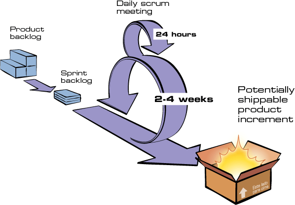
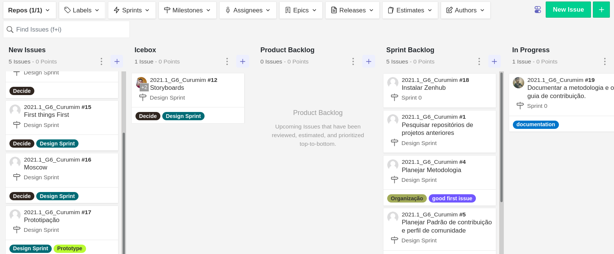

## Introdução
&emsp;&emsp;Para um bom desenvolvimento do projeto, a equipe optou por utilizar uma metodologia mista que, adotando conceitos e práticas de metodologias consagradas, agregue muito valor e auxilie os integrantes no andamento do projeto. 
&emsp;&emsp;Foram escolhidas e adaptadas práticas de três metodologias diferentes: [scrum](https://www.scrum.org/), [extreme programming](http://www.extremeprogramming.org/) e kanban.

## Scrum
&emsp;&emsp;Se trata de uma metodologia ágil com foco na gestão e no planejamento de projetos de software. 
&emsp;&emsp;No scrum, o desenvolvimento é iterativo com as **sprints** sendo a aplicação das iterações. Cada sprint é planejada nas reuniões de **sprint planning** e dura de uma a quatro semanas e representa a Time Box na qual um conjunto de atividades deve ser executado. 
&emsp;&emsp;Nós utilizamos o GitHub para desenvolver um diálogo sobre incluir o Scrum na metodologia a ser utilizada. A conversa foi realizada através de uma [issue](https://github.com/UnBArqDsw2021-1/2021.1_G6_Curumim/issues/4). 
&emsp;&emsp;Dentre as práticas e conceitos dessa metodologia, a equipe optou em fazer a utilização dos seguintes:

- **Sprints:** cada sprint terá a duração de 1 semana, começando e terminando aos sábados;
- **Sprint Planning:** ao iniciar uma sprint, será realizado o planejamento da mesma fazendo a utilização do **Backlog do Produto** para definir as tarefas que serão adicionadas ao **Backlog da Sprint**;
- **Daily:** de segunda a sexta serão realizados, por meio do canal de texto no [Discord](https://discord.com/), compartilhamentos sobre o andamento individual por parte de cada participante, procurando notificar o que fez naquele dia, o que pretende fazer no próximo e as adversidades passadas;
- **Review e Retrospective:** no final das sprints será realizada a reunião de restrospectiva e revisão da sprint, para discutir o andamento da sprint terminada e elicitar pontos de melhorias para as próximas. 

[Figura 1: Scrum Framework. Fonte: DesenvolvimentoAgil.com.br](../../assets/imagens/metodologia/ciclo_scrum.gif)

## Extreme Programming
&emsp;&emsp;Com o advento do manifesto ágil, nasce a metodologia Extreme Programming (XP). Visando sempre uma maior qualidade, um menor tempo e a economia, essa metodologia apresenta um conjunto de valores, principios e práticas muito diferentes das formas tradicionais de se desenvolver software. 
&emsp;&emsp;Nós utilizamos o GitHub para desenvolver um diálogo sobre incluir o Extreme Programming na metodologia a ser utilizada. A conversa foi realizada através de uma [issue](https://github.com/UnBArqDsw2021-1/2021.1_G6_Curumim/issues/4). 
&emsp;&emsp;Dentre as práticas e conceitos dessa metodologia, a equipe optou por fazer a utilização dos seguintes:

- **Baby Steps:** nas implementações e tratativas gerais do projeto, serão feitas apenas pequenas mudanças de cada vez com o intuito de se avançar sempre um pouco por vez, porém, com segurança;
- **Valores:** serão adotados os [valores do XP](http://www.extremeprogramming.org/values.html);
- **Pair Programming** sempre que cabível, as tarefas serão designadas para duplas, visando uma qualidade maior e o compartilhamento do conhecimento.

## Kanban
&emsp;&emsp;Kanban é um termo em japonês que significa "cartão". Essa metodologia auxilia no controle da produção ou gestão de tarefas. Utilizando conceitos simples como o de **quadro** no qual terão **cartões** dispostos em **colunas**, o Kanban permite realizar a categorização e limitação das tarefas e, em conjunto com as demais práticas já citadas, tende a agregar bastante valor ao projeto. 
&emsp;&emsp;Nós utilizamos o GitHub para desenvolver um diálogo sobre incluir o Kanban na metodologia a ser utilizada. A conversa foi realizada através de uma [issue](https://github.com/UnBArqDsw2021-1/2021.1_G6_Curumim/issues/4). 
&emsp;&emsp;Para o presente projeto, essa metodologia será aplicada utilizando o ZenHub no GitHub.

[Figura 2: Layout do quadro do ZenHub.](../../assets/imagens/metodologia/zen-hub.png)

## Bibliografia
> - Videoaulas e materiais complementares presentes no moodle da disciplina Arquitetura e Desenho de Software. Disponível em <https://aprender3.unb.br/course/view.php?id=8603>. Acesso em: 02 ago. 2021. 
> - DESENVOLVIMENTO ÁGIL. Scrum, 2013/2014. Disponível em: <http://www.desenvolvimentoagil.com.br/scrum/>. Acesso em: 02 ago. 2021.
> - DESENVOLVIMENTO ÁGIL. Extreme Programming, 2013/2014. Disponível em: <http://www.desenvolvimentoagil.com.br/xp/>. Acesso em: 02 ago. 2021.
> - EXTREME PROGRAMMING. The Values of Extreme Programming, 2009. Disponível em: <http://www.extremeprogramming.org/values.html>. Acesso em: 02 ago. 2021.
> - ESPINHA, ROBERTO. Kanban: O que é e TUDO sobre como gerenciar. Artia, 2019. Disponível em: <https://artia.com/kanban/>. Acesso em: 02 ago. 2021.

## Versionamento
| Versão | Data | Modificação | Autor |
|:-:|--|--|--|
|1.0|02/08/2021| Abertura do documento | Daniel Porto |
|1.1|04/08/2021| Correções de ortografia e digitação | Daniel Porto |
|1.2|17/09/2021| Atualização de informações de acordo com o feedback da entrega 1 | Gabriel Bonifácio |