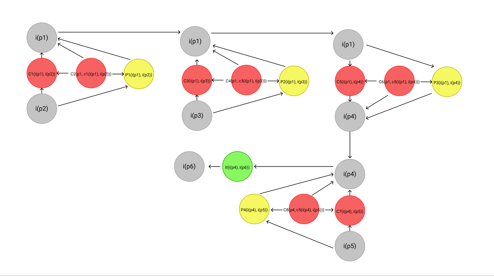
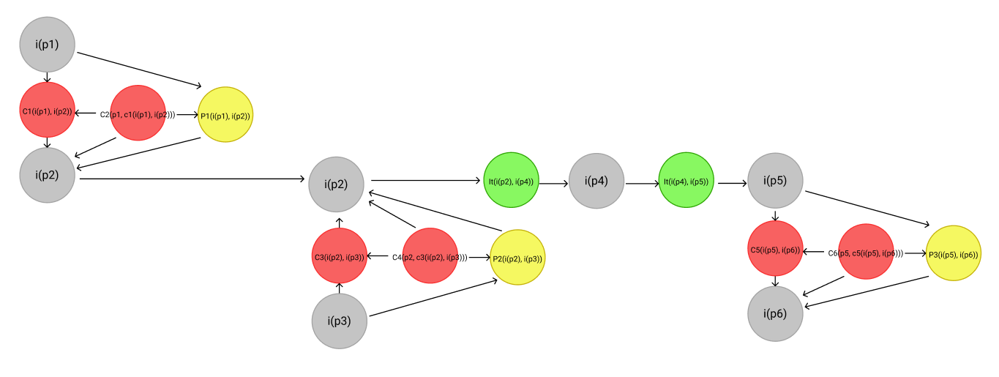
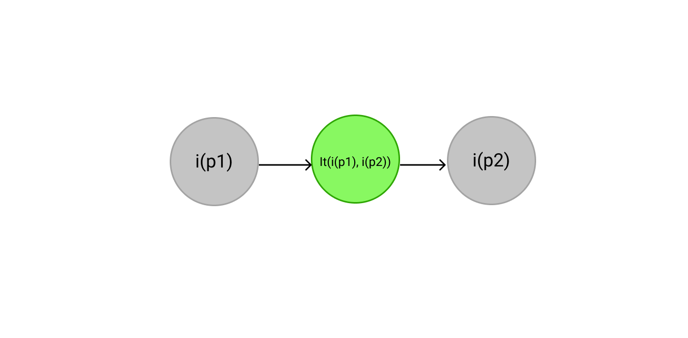

## Introdução
&emsp;&emsp;A argumentação pode ser caracterizada como uma forma vital da cognição humana, representando assim uma atividade de comunicação essencial para a sociedade.

&emsp;&emsp;Para a utilização no projeto o grupo optou pelo framework ACE, que é muito utilizado na engenharia de requisitos, sendo o objetivo deste modelo a validação e verificação relativa dos artefatos discutidos em reuniões.

&emsp;&emsp;O ACE basicamente consiste em uma linguagem que busca representar um conjunto de informações obtidas a partir de uma discussão, uma condição de aceitabilidade que representa uma decisão comum dos participantes a respeito de algum artefato e algoritmos que realizam a verificação da condição de aceitabilidade nas discussões.

## Metodologia
&emsp;&emsp;Para a o desenvolvimento desse artefato, a equipe utilizou um [issue no GitHub](https://github.com/UnBArqDsw2021-1/2021.1_G6_Curumim/issues/14) onde foi descrita todas as argumentações a cerca dos temas propostos pelos integrantes da equipe durante uma chamada.

## ACE
&emsp;&emsp;Basicamente os modelos de argumentação, gerados com base na linguagem contida no ACE, são grafos direcionados com rótulos. Os vértices são classificados com base em quatro rótulos:

- i: Representa vértices de informação que servem de entrada ou saída para inferências;
- It: Representa inferências;
- P: Representa regras de preferência envolvendo a predileção de dois ou mais vértices do grafo;
- C: Representa regras de conflito envolvendo dois ou mais vértices em um grafo;

#### Permanencia do requisito REQB_05
- i(p1) - Bruno: Acho que devemos tirar os gráficos dos requisitos visto que a aplicação não gerará dados que precisem ser representados em gráficos.
- i(p2) - Gabriel: Acho que podemos deixar o requisito com uma prioridade baixa.
- P1(i(p1), i(p2)) - Todos: Os gráficos teriam pouco valor agregado para o produto final e o custo para a produção poderiam acabar afetando outras funcionalidades de maior valor.
- i(p3) - Edson: O gráfico faz parte do relatório geral que está bem centrado no escopo do projeto.
- P2(i(p1), i(p3)) - Todos: Apesar da funcionalidade estar alinhada com o requisito inicial, nele não é especificado de fato a forma como as informações devem ser disponibilizadas.
- i(p4) - Francisco: A presença dos alunos pode ser representada em gráficos.
- P3(i(p4), i(p1)) - Todos: Apesar de não haver a necessidade da criação de gráficos para todos os dados gerados na aplicação, a disponibilização deles especificamente para o acompanhamento da frequência dos alunos seria extremamente útil para os pais.
- i(p5) - Enzo: Como são crianças de até 5 anos, os [responsáveis](/base/requisitos/modelagem/lexicos/#lexico-responsavel) precisam leva-las até o centro educacional, o que os dá a certeza da presença na aula.
- It(i(p4), i(p6)) - Todos: Seria importante disponibilizar o gráfico de presença do aluno para que o [responsável](/base/requisitos/modelagem/lexicos/#lexico-responsavel) possa acompanhar as entradas e saídas da criança, especialmente em casos que não seja o tal [responsável](/base/requisitos/modelagem/lexicos/#lexico-responsavel) que deixa a criança no centro educacional.
- i(p6) - João: Nem sempre será o [responsável](/base/requisitos/modelagem/lexicos/#lexico-responsavel) que levará a criança, o que faz que seja necessário os dados de presença.

[Figura 1: Permanencia do requisito REQB_05](../../../assets/imagens/argumentacao/arg-1.png)

- DECISÃO - Houve um consenso em retirar o requisito em questão com a condição de deixar os dados de presença.

#### Identificação do tipo de usuário
- i(p1) - Bruno: Poderia ser criada uma página especifica somente para os administradores.
- i(p2) - João: Pode ser desenvolvido um ambiente comum para todos que diferencie os tipos de usuários a partir dos dados do mesmo.
- P1(i(p2), i(p1)) - Todos: O custo para produção e manutenção de uma página especifica para administradores é maior que para a produção de um ambiente comum a todos os usuários e que realize a diferenciação atravéz dos dados do usuário.

[Figura 2: Identificação do tipo de usuário](../../../assets/imagens/argumentacao/arg-2.png)

- DECISÃO: Houve um consenso para desenvolver um ambiente comum para todos que diferencie os tipos de usuários a partir dos dados.

#### Desenvolvimento Full-stack de cada feature
- i(p1) - Bruno: Acho que é melhor que os responsáveis pela feature deselvolva ela do banco ao front.
- i(p2) - Matheus: Não tenho experiência com esse tipo de trabalho e ficaria confuso com todas as frentes ao mesmo tempo.
- P1(i(p2), i(p1)) - Todos: Aumentaria muito a carga de trabalho em cima de cada integrante exigir que ele desenvolva todas as frentes da feature.
- i(p3) - Bruno: Podem haver falhas na comunicação e prejudicar o desenvolvimento de um funcionalidade por completo.
- P2(i(p2), i(p3)) - Todos: É preferivel que o grupo dê maior atenção e se certifique que haja uma boa comunicação a sobrecarregar os integrantes.
- It(i(p2), i(p4)) - Todos: Com o desenvolvimento de uma arquitetura o compartilhamento das tarefas dentro de uma feature vai estar menos propenso a erros.
- i(p4) - Matheus: Com o desenvolvimento da arquitetura o entendimento geral vai mitigar essas dificuldades.
- It(i(p4), i(p5)) - Todos: Mesmo com a divisão das frentes de trabalho a falta de conhecimento sobre determinadas tecnologias ainda pode ser um problema.
- i(p5) - Bruno: Sinto que não tem muitas pessoas com aptidão ao front-end, o que pode sobrecarregar alguns integrantes.
- i(p6) - Francisco: A equipe tem muitos integrantes que podem ser alocados conforme a necessidade.
- P(i(p6), i(p5)) - Todos: O número elevado de integrantes na equipe pode diminuir a sobrecarga individual referente a necessidade do aprendizado de uma nova tecnologia.

[Figura 3: Desenvolvimento Full-stack de cada feature](../../../assets/imagens/argumentacao/arg-3.png)

- DECISÃO: Houve um consenso em seguir o desenvolvimento modularizado com o cuidado para não sobrecarregar ninguém.

#### Requisitos não funcionais
- i(p1) - Nilo: Alguns requisitos elicitados não podems ser caracterizados como requisitos não funcionais pois não podem ser testados.
- It(i(p1), i(p2)) - Todos: Existe a necessidade dos requisitos não funcionais serem testáveis.
- i(p2) - Todos: Requisitos não funcionais precisam ser testáveis.

[Figura 4: Requisitos não funcionais](../../../assets/imagens/argumentacao/arg-4.png)

- DECISÃO: Sem qualquer conflito, foram retirados os RNFI_01, RNFI_02 e RNFI_11 e, também, foram atualizados os RNFI_05 E RNFI_07.

## Bibliografia
> - JURETA, I.; MYLOPOULOS, J.; FAULKNER, S. Analysis of multi-party agreement in requirements validation. In: Proceedings of the 2009 17th IEEE International Requirements Engineering Conference, RE. Washington, DC, USA: IEEE Computer Society, 2009. (RE ’09), p. 57–66. ISBN 978-0-7695-3761-0. Disponível em: <http://dx.doi.org/10.1109/RE.2009.8>.
> - CAVALCANTE, André C. A. ACE-CAST: Uma Ferramenta de Apoio à Argumentação Colaborativa. Orientador: Dr. Maurício Serrano. 2014. Trabalho de Conclusão de Curso (Bacharelado em Engenharia de Software) - Universidade de Brasília / Faculdade do Gama, Brasília, 2014.

## Versionamento
| Versão | Data | Modificação | Autor |
| :-: | -- | -- | -- |
|0.1| 02/08/2021 | Debate entre os integrantes e geração das argumentações | Todos os integrantes |
|1.0| 03/08/2021 | Adição da introdução, da Metodologia, dos diagramas e da bibliografia | Nilo Mendonça |