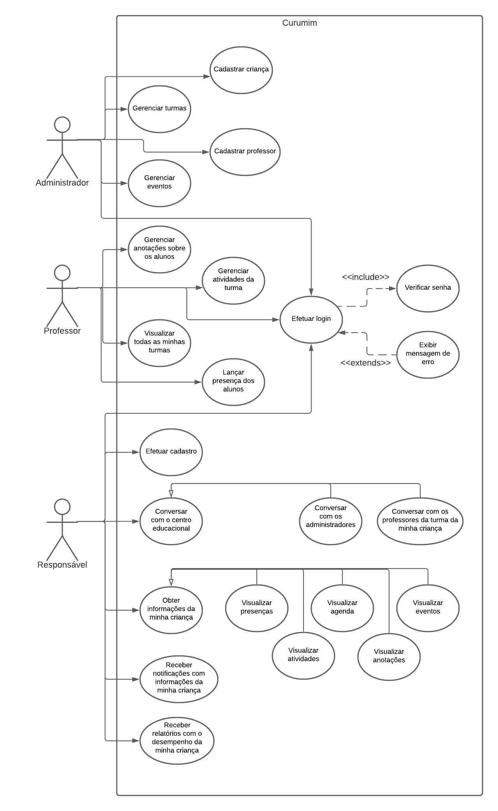

# Casos de uso   Iniciativa Extra

## Introdução
&emsp;&emsp;Os diagramas de casos de uso são diagramas que fazem uso da notação UML (Unified Modeling Language) e buscam descrever as funcionalidades propostas para um determinado sistema, é considerada uma excelente ferramenta para auxilio no levantamento de requisitos funcionais. Um caso de uso basicamente representa a interação entre um ator que pode ser uma pessoa ou entidade máquina que interage com o sistema para executar algum trabalho. Segundo Guedes (2004) é o diagrama mais utilizado e o mais importante da UML, servindo de apoio para a maioria dos outros diagramas. 
&emsp;&emsp;Na figura abaixo são representados os principais componentes de um diagrama de casos de uso:

[Figura 1: Componentes do diagrama de casos de uso](../../../assets/imagens/casos-de-uso/componentes.png)

## Diagrama
&emsp;&emsp;Como proposta, o grupo elaborou o diagrama abaixo para representar as interações entre a aplicação Curumim e os atores.

[Figura 2: Diagrama de casos de uso](../../../assets/imagens/casos-de-uso/casos-de-uso.png)

## Bibliografia
> - [Diagrama de Casos de Uso do projeto QRodízio](https://unbarqdsw.github.io/2020.1_G10_QRodizio/modelagem/diagramas_dinamicos/diagrama_casos_de_uso.html#introducao);
> - VAZQUEZ, Carlos; Simões, Guilherme (2016). Engenharia de Requisitos: Software Orientado ao Negócio.
> - GUEDES, G. T. A. UML: Uma abordagem pratica. 1 ed. São Paulo:Novatec, 2004.

## Versionamento
| Versão | Data | Modificação | Autor |
| :-: | -- | -- | -- |
|1.0| 10/08/2021 | Adição da introdução, do diagrama de casos de uso e da bibliografia | Nilo Mendonça |
|1.1| 15/08/2021 | Revisão por pares | Edson Soares e Francisco Emanoel |
|1.2| 17/09/2021 | Revisão e correção do documento segundo feedback da professora | Edson Soares e Nilo Mendonça |