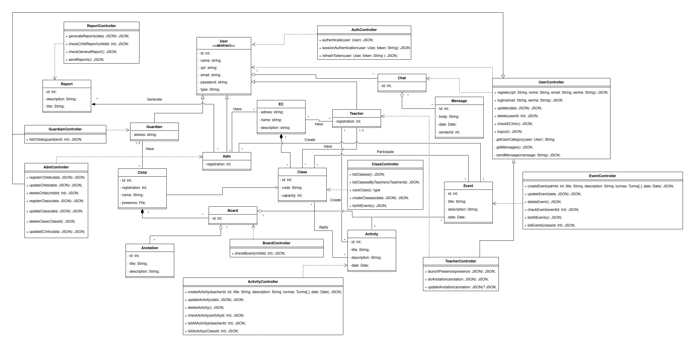

# Diagrama de Classes
 
## Introdução
 
&emsp;&emsp;O Diagrama de Classes é utilizado para representar e descrever a estrutura estática de classes do sistema, definindo os atributos, métodos e relacionamentos entre as classes. Além disso, fornece uma visão geral do comportamento estático do sistema, e pode ser utilizado como base para outros diagramas UML. 
&emsp;&emsp;Segundo Guedes decorre em seu livro, em alguns métodos de desenvolvimento de software, como o Processo Unificado, é recomendado utilizar o diagrama de classe ainda na fase de análise. Assim, "produzindo-se um modelo conceitual a respeito das informações necessárias ao software." (Gilleanes T. A. Guedes, 2018)[[3]](#bibliografia). 
&emsp;&emsp;No modelo conceitual, nos preocupamos basicamente em apresentar as informações que a aplicação necessitará, no contexto de classes e seus atributos, assim como as associações entre as classes. Nessa etapa não modelamos características que essas classes poderão ter, como por exemplo os métodos, que serão descobertos na fase de modelagem dinâmica nos diagramas de interação. 

## Metodologia

&emsp;&emsp;O desenvolvimento do diagrama de classes levou em consideração as decisões de técnologias e estruturas que serão utilizadas no projeto. Sendo assim, o diagrama de classes aborda a representação das classes que serão desenvolvidas na API do projeto, a qual contará com arquitetura MVC. 
&emsp;&emsp;Portanto, foi focada a representação das entidades que compõem as camadas de modelos e controllers. 
&emsp;&emsp;É importante mencionar que os nomes das classes, de seus atributos e métodos foram representados em Inglês e no estilo CamelCase para que, desde já, seja feita uma padronização no que se refere ao que será implementado em código.

 

[Figura 1: Diagrama de classes](../../assets/imagens/diagrama-de-classes/Diagrama-de-classes.png)

 
#### **Observações**: 
- Todos os atributos privados possuem métodos Getters e Setters, e não foram incluídos no diagrama para facilitar a visualização.
- A maioria dos métodos das classes controllers tem relação de dependência com a classe AuthController, tais relações não foram incluídas no diagrama para facilitar a visualização.
 
## Bibliografia
> - [1]UML Package Diagrams Overview. Disponível em: https://www.uml-diagrams.org/package-diagrams-overview.html. Acesso em: 13/08/2021.
> - [2]Videoaulas e materiais complementares presentes no moodle da disciplina Arquitetura e Desenho de Software. Disponível em <https://aprender3.unb.br/course/view.php?id=8603>. Acesso em: 14 ago. 2021.
> - [3]Gilleanes T. A. Guedes, Diagrama de Classes. Google books, 2018. Disponível em: <https://books.google.com.br/books?hl=pt-BR&lr=&id=mJxMDwAAQBAJ&oi=fnd&pg=PA53&dq=diagrama+de+classe+uml&ots=x9uROl_On9&sig=xduDOmvkHH2KllmvDMq2_w9VyiQ#v=onepage&q=diagrama%20de%20classe%20uml&f=false> Acesso em: 19/09/2021.

## Versionamento
| Versão | Data | Modificação | Autor |
| :-: | -- | -- | -- |
|0.1| 13/08/2021 | Criação do Diagrama de classes              |  Daniel Porto, Eliseu Kadesh  |
|1.0| 20/08/2021 | Abertura do Documento                       |  Eliseu Kadesh |
|1.1| 20/08/2021 | Adição da metodologia                       |  Daniel Porto  |
|2.0| 21/08/2021 | Correções no Diagrama de Classes            |  Eliseu Kadesh |
|2.1| 21/08/2021 | Revisão por pares | Bruno Félix, Francisco Emanoel |
|2.2| 19/09/2021 | Revisão segundo o feedback da professora | Edson Soares e Nilo Mendonça |
