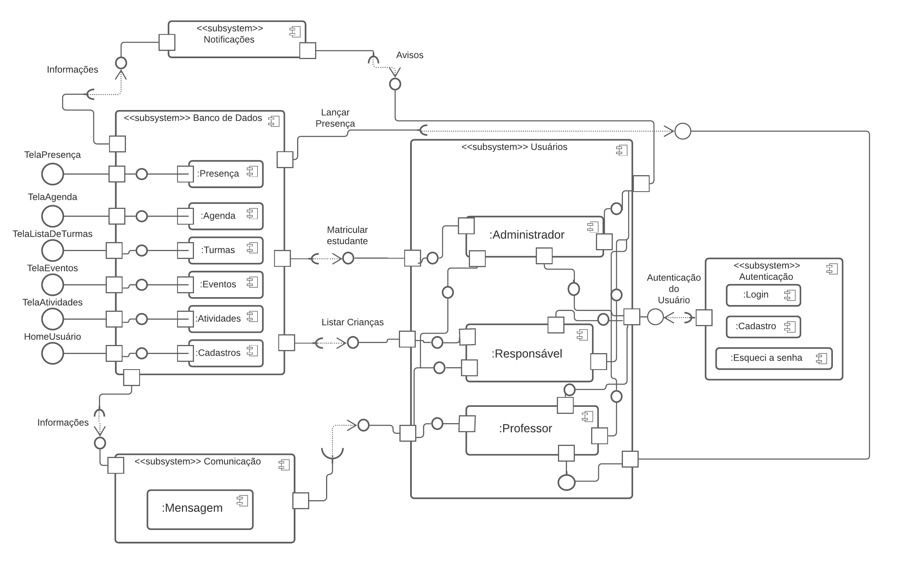

## Introdução
&emsp;&emsp;O diagrama de componentes é fundamental na criação de um sistema de software. É feito utilizando a linguagem UML, facilitando o entendimento da estrutura dos sistemas existentes. Neste diagrama é possível ver o relacionamento entre os componentes de um sistema. No caso do UML 2.0, o termo "componente" refere-se a um módulo de classes que representa sistemas ou subsistemas independentes com capacidade de interagir com o restante do sistema.

[Diagrama 1: Diagrama de componentes](../../assets/imagens/diagrama-de-componentes/diagrama-de-componentes.png)

## Bibliografia
> -   UML Component Diagrams: https://www.uml-diagrams.org/component-diagrams.html. Último acesso em 21/08/2021.
> -   Diagrama de componentes UML: o que é, como fazer e exemplos: https://www.lucidchart.com/pages/pt/diagrama-de-componentes-uml. Último acesso em 21/08/2021.

## Versionamento
| Versão | Data | Modificação | Autor |
| :-: | -- | -- | -- |
|0.1| 13/08/2021 | Início do artefato | Mateus O. Patrício e Gabriel Bonifácio |
|1.0| 13/08/2021 | Abertura do documento e adição da introdução  | Mateus O. Patrício |
|1.2| 14/08/2021 | Melhoria do artefato | Mateus O. Patrício e Gabriel Bonifácio |
|1.3| 18/08/2021 | Melhoria do artefato | Mateus O. Patrício e Gabriel Bonifácio |
|1.4| 20/08/2021 | Finalizada versão 1.0 do artefato | Gabriel Bonifácio |
|2.0| 21/08/2021 | Adição do artefato e da bibliografia ao documento | Mateus O. Patrício |
|2.1| 21/08/2021 | Revisão por pares | Daniel Porto, Francisco Emanoel |