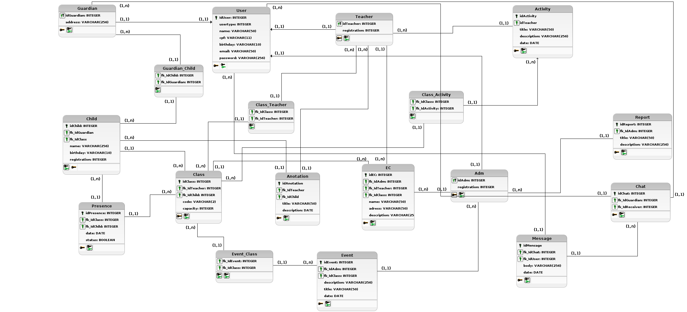

# Diagrama lógico do banco de dados   Iniciativa Extra
 
## Introdução
&emsp;&emsp; O modelo lógico é o resultado ou produto da conversão de um modelo conceitual para um determinado tipo de banco de dados, ou conforme Heuser, “Um modelo lógico é uma descrição de um banco de dados no nível de abstração visto pelo [usuário](/2021.1_G6_Curumim/base/requisitos/modelagem/lexicos/#lexico-usuario) do sistema gerenciador."
 
## Metodologia
&emsp;&emsp;Primeiramente foi realizada a revisão dos artefatos [MER](../modelagem-estatica/MER.md) e [DER](../modelagem-estatica/DER.md) que foram previamente desenvolvidos, pois estes documentos são utilizados como base para os demais processos de modelagem do banco de dados.
Depois de algumas discussões durante a construção do modelo lógico, foi observado que algumas questões nos artefatos da modelagem conceitual, poderiam ser adaptados durante essa etapa e com isso definir de maneira coerente a modelagem lógica. 
&emsp;&emsp;Foi utilizada a ferramenta [Br Modelo](http://www.sis4.com/brmodelo/) na versão desktop para a construção do diagrama.
 
## Diagrama Lógico
&emsp;&emsp;O diagrama lógico representa de forma gráfica a modelagem lógica do banco de dados, geralmente utilizando a notação UML. Este modelo possui um nível de abstração menor que o [DER](../modelagem-estatica/DER.md), já que o diagrama lógico define as relações e atributos das tabelas no banco de dados, adaptando-os especificamente para o banco de dados escolhido,  que no caso do projeto será um banco de dados [PostgreSQL](https://www.postgresql.org/).
 
&emsp;&emsp;

[Figura 1: Diagrama Lógico](../../assets/imagens/diagrama-logico-bd/diagrama-logico-bd-curumin.png)

 
#### **Legenda dos simbolos**: 
- Chave preta: Chave primária
- Chave verde: Chave estrangeira
 
#### **Observações**: 
- As tabelas [Adm](/2021.1_G6_Curumim/base/requisitos/modelagem/lexicos/#lexico-administrador), [Teacher](/2021.1_G6_Curumim/base/requisitos/modelagem/lexicos/#lexico-professor) e [Guardian](/2021.1_G6_Curumim/base/requisitos/modelagem/lexicos/#lexico-responsavel), cada uma possuem uma chave primária que também é uma chave estrangeira que faz referência a tabela [User](/2021.1_G6_Curumim/base/requisitos/modelagem/lexicos/#lexico-usuario), que será a tabela que possui de fato as informações pessoais de cada tipo de [usuário](/2021.1_G6_Curumim/base/requisitos/modelagem/lexicos/#lexico-usuario), e um identificar de qual tipo é aquele [usuário](/2021.1_G6_Curumim/base/requisitos/modelagem/lexicos/#lexico-usuario).
- A cardinalidade (1:1) da relação entre a tabela User e as demais relacionadas a ela, evidenciam que deveria ser feito a união de tabelas, da tabela [User](/2021.1_G6_Curumim/base/requisitos/modelagem/lexicos/#lexico-usuario) com as das demais tabelas relacionadas a ela, porém para este caso em específico, as tabelas vão “herdar” os atributos da tabela [User](/2021.1_G6_Curumim/base/requisitos/modelagem/lexicos/#lexico-usuario), por isso a cardinalidade (1:1).
- O [Board](/2021.1_G6_Curumim/base/requisitos/modelagem/lexicos/#lexico-mural) que antes estava presente no [MER](../modelagem-estatica/MER.md) e [DER](../modelagem-estatica/DER.md), pela sua cardinalidade em relação a tabela [Child](/2021.1_G6_Curumim/base/requisitos/modelagem/lexicos/#lexico-crianca) seria adequado que fosse incorporada a tabela [Child](/2021.1_G6_Curumim/base/requisitos/modelagem/lexicos/#lexico-crianca), porém depois de alguns debates e análises, foi evidenciado que os atributos presentes na tabela [Board](/2021.1_G6_Curumim/base/requisitos/modelagem/lexicos/#lexico-mural) não teriam utilidade no desenvolvimento, e deixaria a tabela [Child](/2021.1_G6_Curumim/base/requisitos/modelagem/lexicos/#lexico-crianca) com muita informação desnecessariamente, por isso o [Board](/2021.1_G6_Curumim/base/requisitos/modelagem/lexicos/#lexico-mural) acabou ficando de fora da modelagem final.
 
 
## Bibliografia
> - Vídeo aula : Modelagem de dados - modelo conceitual, lógico e físico. Disponível em: <https://www.youtube.com/watch?v=8CkMX2qXgdY>. Acesso em: 25 ago, 2021;
> - HEUSER, Carlos Alberto. Projeto de Banco de Dados, Porto Alegre: Instituto de informática da UFRGS, Sagra Luzzato, 2001 Série livros didáticos n.º 4. Acesso em: 30 ago, de 2021;
> - brModelo: FERRAMENTA DE MODELAGEM CONCEITUAL DE BANCO DE DADOS. Disponível em:
<http://www.fernandozaidan.com.br/ined/bd/outros/brModelo.pdf>. Acesso em: 30 ago, 2021;
 
 
## Versionamento
| Versão | Data | Modificação | Autor |
| :-: | -- | -- | -- |
| 0.1 | 25/08/2021 | Discussão sobre o [MER](../modelagem-estatica/MER.md) e [DER](../modelagem-estatica/DER.md) | Edson Soares e Eliseu Kadesh |
| 0.2 | 27/08/2021 | Desenvolvimento do diagrama lógico   | Edson Soares e Eliseu Kadesh |
| 0.3 | 27/08/2021 | Discussão para reajustar a modelagem | Edson Soares, Eliseu Kadesh, Daniel Porto |
| 1.0 | 30/08/2021 | Abertura do documento          | Edson Soares, Eliseu Kadesh |
| 1.1 | 30/08/2021 | Adição de link para o léxicos  | Eliseu Kadesh |
| 1.2 | 30/08/2021 | Revisão por pares              | Gabriel Bonifácio, Francisco Ferreira |