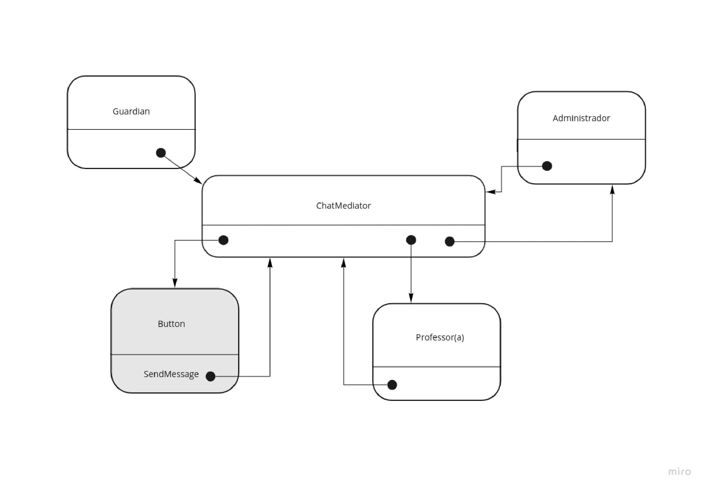

# GOFs Comportamentais

## Command

## Iterator

## Mediator
&emsp;&emsp;Define um objeto que encapsula como um conjunto de objetos
interage. O Mediator promove o acoplamento fraco ao evitar que os objetos se refiram
explicitamente uns aos outros, permitindo que você varie suas interações
independentemente. Definição de Erich Gamma, Richard Helm, Ralph Johnson e John
Vlissides. 
&emsp;&emsp;O padrão Mediator é responsável por controlar e coordenar a interação de um conjunto de objetos.

### Estrutura de Objetos
&emsp;&emsp;Para exemplificar a aplicação do padrão Mediator na interação dos objetos do chat entre Guardian, Administrador e Professor(a). Apresentamos um diagrama de objetos que se comunicam através de um intermediário. 
&emsp;&emsp;Na estrutura abaixo incluímos um componente do frontend que consiste em um botão para representar o envio de mensagem. Podemos observar a interação desse componente da seguinte maneira: O botão inicia desativado, sempre que um caractere seja digitado no campo de texto, o botão muda seu estado para ativado. Aqui podemos observar que o padrão mediator possibilita diversos objetos interagindo uns com os outros por meio de um mediador.

[Figura ?: Estrutura de objetos](../../assets/imagens/gofs/estrutura_objetos.jpg)

### Diagrama de classe (Chat)
&emsp;&emsp;

[Figura ?: Interação dos objetos](../../assets/imagens/gofs/mediator_diagrama_classe.jpg)

&emsp;&emsp;O diagrama acima demonstra a interação de objetos da seguinte situação: O sistema conta com um chat onde acontece uma troca de mensagens entre os usuários, porém essa comunicação acontece de uma forma relativamente complexa, pois o Guardian pode se comunicar com qualquer um dos outros dois usuários, Administrador ou com o(a) Professor(a). Logo, considera-se necessário criar um mediador para intermediar as mensagens e o chat fluir de uma melhor forma. Nesse caso os objetos conhecem apenas o Mediator.

### Implementação (Protótipo)
        function User(name)
        {
        this.name = name
        this.chatroom = null
        }

        User.prototype = {
        send: function(message, toUser)
        {
            this.chatroom.send(message, this, toUser)
        },
        receive: function(message, fromUser)
        {
            return {"sender": fromUser.name, "receiver": this.name, "message": message}
        }
        }

        function Chatroom()
        {
        this.users = {}
        }

        Chatroom.prototype = {
        addUser: function(user)
        {
            this.users[user.name] = user
            user.chatroom = this
        },
        send: function(message, fromUser, toUser)
        {
            toUser.receive(message, fromUser)
        }
        }

## Bibliografia

> - [1] LARMAN, Craig. <b>Utilizando UML e Padrões</b>: Uma introdução à análise e ao projeto orientados a objetos e ao desenvolvimento iterativo. 3. ed. [S. l.: s. n.], 2004.
> - [2] GAMMA, Erich; HELM, Richard; JOHNSON, Ralph; VLISSIDES, John. Design
Patterns: Elements of Reusable Object-Oriented Software. Estados Unidos:
Hardback, 1995. 416 p. Erich Gamma, Richard Helm, Ralph Johnson, John
Vlissides

## Versionamento
| Versão | Data | Modificação | Autor |
|--|--|--|--|
|1.0|10/09/2021| Abertura do documento | Mateus O. Patrício |
|1.1|16/09/2021| Introdução ao Mediator e inclusão de bibliografia [2] | Edson Soares |
|1.2|16/09/2021| Inclusão do diagrama Mediator | Edson Soares |
|1.3|17/09/2021| Explicação do diagrama de classe | Edson Soares |
|1.4|19/09/2021| Construção da estutura de objetos | Edson Soares |
|1.5|19/09/2021| Implementação | Edson Soares |
|1.6|19/09/2021| Revisão do padrão Mediator | Bruno Felix e Eliseu Kadesh |