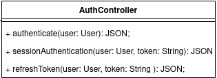
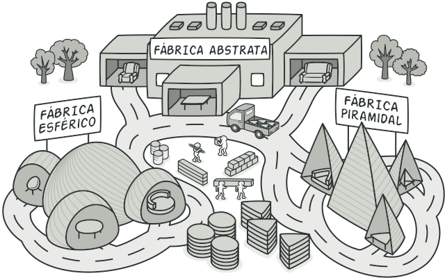

# GOFs Criacionais

## Introdução

&emsp;&emsp;Os padrões de projeto Criacionais se preocupam basicamente com a maneira como os objetos são criados, buscando reduzir a instabilidade e complexidade, criando objetos de maneira controlada. 
&emsp;&emsp;O novo operador é considerado prejudicial, principalmente por espalhar objetos por todo o aplicativo. Podendo com o tempo gerar problemas ao alterar uma implementação devido ao fato das classes estarem fortemente acopladas. 
&emsp;&emsp;Os Padrões de Criação buscam resolver esse problema separando o cliente do processo de inicialização real. 
&emsp;&emsp;Fazendo uma analogia com uma situação real, quando um mecânico realiza o conserto de um carro ele faz a terceirização das peças, solicitando elas a um fornecedor, para então realizar a instalação, não se preocupando com todo o processo envolvido na criação desses componentes.

## Factory Method

&emsp;&emsp;O Factory Method é um padrão bastante adotado por diversas linguagens. Consiste basicamente na definição de uma interface comum para criação de objetos, deixando para as subclasses a responsabilidade de instanciá-los. Essa estrutura é composta pelas interfaces Product, ConcreteProduct, Creator e ConcreteCreator.

- Product: Se caracteriza como a interface comum dos produtos a serem criados;
- ConcreteProduct: Responsável pela implementação da interface Product, definindo produtos concretos;
- Creator: É uma classe abstrata sendo responsável pela declaração da operação factoryMethod, que retorna um objeto Product. Podendo ainda definir uma implementação padrão e assim retornar um ConcreteProduct específico ou também pode definir alguns métodos que invocam FactoryMethod;
- ConcreteCreator: Basicamente estende a classe Creator, realiza a redefinição do factoryMethod para retornar uma instância de um ConcreteProduct criado;

&emsp;&emsp;Em nosso projeto, é possível utilizar o Factory Method na classe "UserController", onde pode ser implementado uma interface com os atributos e métodos necessários, uma ConcreteProduct que realize a implementação dos métodos, e por meio de uma ConcreteCreater realizar a redefinição específica para cada tipo de usuário.

	 
	[Figura 1: Factory Method](../../assets/imagens/gofs/factory-method.png)

## Abstract Factory

&emsp;&emsp;O Abstract Factory é um padrão de projeto criacional que tem como principal objetivo, permitir a criação de famílias de objetos relacionados ou dependentes sem ter que especificar suas classes concretas. Se considerarmos que o [Curumim](https://github.com/UnBArqDsw2021-1/2021.1_G6_Curumim) terá uma interface gráfica com um sistema operacional diferente do sistema operacional dos elementos gráficos, por exemplo, teremos uma incompatibilidade que deverá ser resolvida, e essa será o nosso impulso a trabalhar com esse padrão de projeto. O Abstract Factory tem como participantes:

- AbstractFactory: declara uma interface para operações de criação de produtos quaisquer;
- ConcreteFactory: implementa as operações que criam objetos de produtos específicos;
- AbstractProduct: declara uma interface para um tipo de objeto produto;
- Product: define um objeto produto a ser criado pela fábrica específica correspondente, implementando a interface declarada em AbstractProduct;
- Client: usa as interfaces declaradas em AbstractFactory e AbstractProduct;

&emsp;&emsp;Em nosso projeto, podemos utilizar o AbstractFactory na classe "AuthController" (via [Diagrama de Classes](../../modelagem/modelagem-estatica/diagrama-de-classes)), por exemplo. Ao iniciar o processo de autenticação, será preciso fazer uma redefinição específica para cada tipo de [usuário](../../base/requisitos/modelagem/lexicos/#lexico-usuario) — com o "ConcreteFactory" —, já que o [administrador](../../base/requisitos/modelagem/lexicos/#lexico-administrador) poderá acessar por meio do "Desktop", enquanto os demais usuários pelo meio ["Mobile"](../../base/requisitos/modelagem/lexicos/#lexico-mobile).

	 
	[Figura 2: AuthController](../../assets/imagens/gofs/auth-controller.png)

&emsp;&emsp;Na imagem abaixo, podemos visualizar uma representação clara do Abstract Factory. Para que não haja uma incompatibilidade, temos também uma fábrica "esférico" e uma "piramidal", e cada um com suas redefinições específicas e necessárias.

	 
	[Figura 3: Abstract Factory](../../assets/imagens/gofs/abstract-factory.png)

## Prototype

&emsp;&emsp;O padrão de projeto Prototype nos permitirá copiar objetos existentes sem que essa parte do código tenha dependência em classes. Quando quisermos criar um objeto igual, não precisamos acionar essas classes, basta fazer a exata cópia do objeto já criado. 

&emsp;&emsp;No nosso projeto, podemos utilizar quando precisarmos utilizar o mesmo botão, por exemplo, em diferentes lugares. Com o mesmo formato, mesmas cores e demais configurações. Na imagem abaixo, visualizamos a ideia principal desse padrão de projeto: clonar esses produtos que tenham a mesma configuração. 

	 
	[Figura 4: Prototype](../../assets/imagens/gofs/prototype.png)

## Singleton
&emsp;&emsp;O Singleton é um padrão bastante discutido dentro do Design Pattern devido sua característica principal de ter somente uma instância de classe para toda a aplicação. Basicamente falando, especifica que apenas uma instância da classe pode existir, fornecendo assim, um ponto de acesso global para instância, possibilitando a recuperação da mesma e a utilização onde essa instância for chamada.

&emsp;&emsp;No nosso projeto esse padrão poderá ser aplicado na implementação da [classe Ec](../../modelagem/modelagem-estatica/diagrama-de-classes/#metodologia), onde somente um objeto será instanciado para todo o código. Só deverá existir um único [Centro Educacional](../../base/requisitos/modelagem/lexicos/#lexico-centro-educacional) e o mesmo deverá estar acessível, de forma global, para toda atividade que requisitá-lo.

~~~javascript
//EC MODEL
class Ec{
	...
	private Instance

  	function createInstance() {
        var object = new EC
        return object;
  	}

	function getInstance() {
        if (!Instance) {
			Instance = createInstance()
        }
		return Instance;
    }
}

//ADMIN CONTROLLER
import User from './EC.js'
class AdmController{
    ...
    async updateECInfo() {
        Ec = Ec.getinstance
		...
    }
}
~~~

## Multiton
&emsp;&emsp;O Multiton é um padrão derivado do Singleton, mas com o intuito de ter um número delimitado de objetos instanciados de classe para toda a aplicação. Ao contrário do Singleton, que somente um objeto deve existir, o Multiton fornece múltiplos objetos para ser usado em caráter global para todo o projeto.

&emsp;&emsp;No nosso projeto o Multiton não se aplica em nenhuma vertente justamente por não haver nenhuma classe que nos beneficiaria ter um número de n objetos, de uma mesma classe, instanciados de forma global. 

## Object Pool
&emsp;&emsp;O Object Pool, ou piscina de objetos, é um padrão de design de criação que consiste fundamentalmente em um conjunto de objetos instanciados e alocados num espaço, denominado "pool", assim quando esse objeto é requisitado ele sai da pool não ficando mais disponível ali. Uma vez chamado esse objeto pode ser utilizado, tratado, e/ou manipulado e, após o término do processo de seu uso, ele é retornado para a pool ao invés de ser destruído, para, novamente, estar acessível para o projeto.

&emsp;&emsp;No nosso projeto o Object Pool não se aplica muito pelo mesmo motivo que o Multiton, não temos oportunidades, dentro do projeto, de termos diversos objetos instanciados em um contêiner para utilização e reutilização global. 

## Bibliografia

> - [Documento GOFS Criacionais do projeto Vestibulandos](https://unbarqdsw.github.io/2020.1_G4_Vestibulandos/padroes_de_projeto/gofs_criacionais/);
> - LARMAN, Craig. <b>Utilizando UML e Padrões</b>: Uma introdução à análise e ao projeto orientados a objetos e ao desenvolvimento iterativo. 3. ed. [S. l.: s. n.], 2004.
> - VALENTIM, Ricardo Alexsandro de Medeiros; SOUZA NETO, Plácido Antônio de. O impacto da utilização de design patterns nas métricas e estimativas de projetos de software: a utilização de padrões tem alguma influência nas estimativas?. 2005.
> - DE ALBUQUERQUE, Marcelo Torres; ROJAS, Alexandre; RIBEIRO, Paulo Cezar M. Utilizando Design Patterns GoF no apoio ao desenvolvimento de um Framework Java. Cadernos do IME-Série Informática, v. 30, p. 13-27, 2010.
> - Abstract Factory. Disponível em: <https://refactoring.guru/pt-br/design-patterns/abstract-factory>. Acesso em: 17 de setembro de 2021.
> - Prototype. Disponível em: <https://refactoring.guru/pt-br/design-patterns/prototype>. Acesso em: 17 de setembro de 2021.
> - Videoaulas e materiais complementares presentes no moodle da disciplina Arquitetura e Desenho de Software. Disponível em https://aprender3.unb.br/course/view.php?id=8603. Acesso em: 17 de setembro de 2021.

## Versionamento
| Versão | Data | Modificação | Autor |
|--|--|--|--|
|1.0|11/09/2021| Abertura do documento | Nilo Mendonça |
|1.1|11/09/2021| Adição da bibliografia e do padrão Factory Method | Nilo Mendonça |
|1.2|11/09/2021| Adição padrão Singleton | Bruno Félix |
|1.3|17/09/2021| Adição da bibliografia e do padrão Abstract Factory e Prototype | Gabriel Bonifácio |
|1.4|19/09/2021| Adição padrão Multiton e Object Pool | Bruno Félix |
|1.5|19/09/2021| Revisão por pares | Bruno Félix e Francisco Ferreira |
|1.6|20/09/2021| Adição da introdução | Nilo Mendonça |
|1.7|20/09/2021| Revisão por pares | Eliseu Kadesh e João Pedro |
