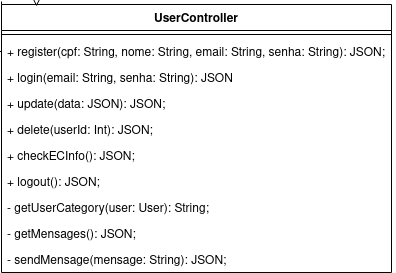

# GOFs Criacionais

## Factory Method

&emsp;&emsp;O Factory Method é um padrão bastante adotado por diversas linguagens. Consiste basicamente na definição de uma interface comum para criação de objetos, deixando para as subclasses a responsabilidade de instanciá-los. Essa estrutura é composta pelas interfaces Product, ConcreteProduct, Creator e ConcreteCreator.

- Product: Se caracteriza como a interface comum dos produtos a serem criados;
- ConcreteProduct: Responsável pela implementação da interface Product, definindo produtos concretos;
- Creator: É uma classe abstrata sendo responsável pela declaração da operação factoryMethod, que retorna um objeto Product. Podendo ainda definir uma implementação padrão e assim retornar um ConcreteProduct específico ou também pode definir alguns métodos que invocam FactoryMethod;
- ConcreteCreator: Basicamente estende a classe Creator, realiza a redefinição do factoryMethod para retornar uma instância de um ConcreteProduct criado;

&emsp;&emsp;Em nosso projeto, é possível utilizar o Factory Method na classe "UserController", onde pode ser implementado uma interface com os atributos e métodos necessários, uma ConcreteProduct que realize a implementação dos métodos, e por meio de uma ConcreteCreater realizar a redefinição especifica para cada tipo de usuário.

	 
	[Figura 1: Factory Method](../../assets/imagens/gofs/factory-method.png)

## Abstract Factory

<!--
## Builder

## Prototype
-->

## Singleton
&emsp;&emsp;O Singleton é um padrão bastante discutido dentro do Design Pattern devido sua característica principal de ter somente uma instância de classe para toda a aplicação. Basicamente falando, especifica que apenas uma instância da classe pode existir, fornecendo assim, um ponto de acesso global para instância, possibilitando a recuperação da mesma e a utilização onde essa instância for chamada.

&emsp;&emsp;No nosso projeto esse padrão poderá ser aplicado na implementação da classe Ec, onde somente um objeto será instanciado para todo o código. Só deverá existir um único Centro Educacional e o mesmo deverá estar acessível, de forma global, para toda atividade que requisitá-lo.

~~~javascript
//EC MODEL
class Ec{
	...
	private Instance

  	function createInstance() {
        var object = new EC
        return object;
  	}

	function getInstance() {
        if (!Instance) {
			Instance = createInstance()
        }
		return Instance;
    }
}

//ADMIN CONTROLLER
import User from './EC.js'
class AdmController{
    ...
    async updateECInfo() {
        Ec = Ec.getinstance
		...
    }
}
~~~

## Multiton
&emsp;&emsp;O Multiton é um padrão derivado do Singleton, mas com o intuito de ter um número delimitado de objetos instanciados de classe para toda a aplicação. Ao contrário do Singleton, que somente um objeto deve existir, o Multiton fornece múltiplos objetos para ser usado em caráter global para todo o projeto.

&emsp;&emsp;No nosso projeto o Multiton não se aplica em nenhuma vertente justamente por não haver nenhuma classe que nos beneficiaria ter um número de n objetos, de uma mesma classe, instanciados de forma global. 

## Object Pool
&emsp;&emsp;

## Bibliografia

> - LARMAN, Craig. <b>Utilizando UML e Padrões</b>: Uma introdução à análise e ao projeto orientados a objetos e ao desenvolvimento iterativo. 3. ed. [S. l.: s. n.], 2004.
> - Composite Design Pattern. Geeks For Geeks Disponível em: <https://www.geeksforgeeks.org/composite-design-pattern/>. Acesso em: 11 de setembro de 2021.
> - VALENTIM, Ricardo Alexsandro de Medeiros; SOUZA NETO, Plácido Antônio de. O impacto da utilização de design patterns nas métricas e estimativas de projetos de software: a utilização de padrões tem alguma influência nas estimativas?. 2005.
> - DE ALBUQUERQUE, Marcelo Torres; ROJAS, Alexandre; RIBEIRO, Paulo Cezar M. Utilizando Design Patterns GoF no apoio ao desenvolvimento de um Framework Java. Cadernos do IME-Série Informática, v. 30, p. 13-27, 2010.

## Versionamento
| Versão | Data | Modificação | Autor |
|--|--|--|--|
|1.0|11/09/2021| Abertura do documento | Nilo Mendonça |
|1.1|11/09/2021| Adição da bibliografia e do padrão Factory Method | Nilo Mendonça |
|1.2|11/09/2021| Adição padrão Singleton | Bruno Félix |
|1.3|19/09/2021| Adição padrão Multiton e Object Pool | Bruno Félix |