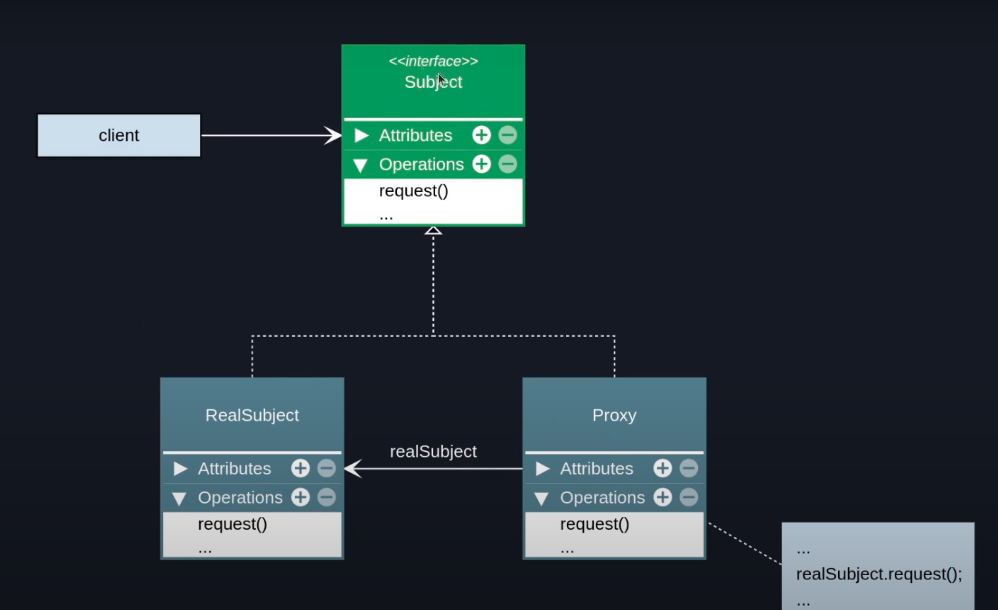

# GOFs Estruturais

## Adapter

## Composite

&emsp;&emsp;O Composite é um padrão de design de particionamento e descreve um grupo de objetos que é tratado da mesma maneira que uma única instância do mesmo tipo de objeto. O objetivo de um Composite é agrupar objetos em estruturas de árvore para representar hierarquias parte-todo. Ele permite que você tenha uma estrutura de árvore e peça a cada folha da árvore que execute uma tarefa. "O Composite é baseado no Polimorfismo e fornece variações protegidas a um cliente então não sofre impacto se seus objetos relacionados forem atômicos ou compostos" (LARMAN, 2004). 

O padrão Composite possui 4 participantes:

- Component: Uma interface ou classe base abstrata para os objetos na estrutura em árvore. Esta classe define o comportamento padrão para todos os objetos e comportamentos para acessar e gerenciar componentes filhos na árvore.
- Leaf: É uma classe que estende Component para representar folhas na estrutura de árvore que não tem nenhum filho.
- Composite: É uma classe que estende Component para representar nós na estrutura da árvore, podendo conter filhos. Esta classe armazena componentes Leaf e implementa os comportamentos definidos em Component para acessar e gerenciar componentes filhos.
- Client: interage com o Component para acessar e manipular objetos na composição.

&emsp;&emsp;Em nosso projeto, é possível utilizar o Composite para gerar o [mural](../../../base/requisitos/modelagem/lexicos/#lexico-mural), onde teremos BoardController sendo o Component, e as leaf sendo a classe Events e a classe Anotations. Abaixo temos um exemplo em javascript:

[Figura 2: Board Composite](../../assets/imagens/gofs/composite-codigo.png)

## Proxy
&emsp;&emsp; O proxy é um padrão que tem intenção de fornecer um substituto de localização para outro objeto, com o objetivo de controlar esse objeto. Essa é a descrição que está na literatura de design patterns, mas de forma mais simplificada seria, o proxy é algo que fica no meio do caminho entre a chamada do objeto e o próprio objeto.

[Figura 2: Proxy](../../assets/imagens/gofs/proxy.png)

&emsp;&emsp; Quais as principais características  de um proxy? 

* O objeto proxy finge ser o objeto real.
* É usado para controle de acesso, logs, cache, lazy instantiation, lazy evaluation, distribuição de serviços.
* Pode escolher como e quando repassar chamadas de método para o objeto real.

&emsp;&emsp; Aleḿ dessas caracteristicas existe um variação de proxy, abaixo iremos lista algumas delas.
 
* **Proxy Virtual:** Controla acesso a recursos que podem ser pesados para criação e utilização.
* **Proxy Remoto:** Faz o controle de recursos que se encontram remotamente.
* **Proxy de Proteção:** Faz o controle de autenticação  e permissão para recursos que precisem de tal.
 
&emsp;&emsp; Na aplicação do curumim usamos a variação de **Proxy de Proteção**, que como já foi dito, é responsável pelo processo de autenticação, como podemos observar na imagem do código abaixo.

[Figura 2: Proxy](../../assets/imagens/gofs/proxy-code.png)

## Bibliografia

> - LARMAN, Craig. <b>Utilizando UML e Padrões</b>: Uma introdução à análise e ao projeto orientados a objetos e ao desenvolvimento iterativo. 3. ed. [S. l.: s. n.], 2004.

> - Composite Design Pattern. Geeks For Geeks Disponível em: <https://www.geeksforgeeks.org/composite-design-pattern/>. Acesso em: 10 de setembro de 2021.

> - ERICH, Gamma. <b>Padrões de projeto</b>:  soluções reutilizáveis de softwareorientado a objetos. Ed. Única 2000.

## Versionamento
| Versão | Data | Modificação | Autor |
|--|--|--|--|
|1.0|10/09/2021| Abertura do documento | João Pedro |
|1.1|10/09/2021| Adicionando topico Composite | João Pedro, Eliseu Kadesh |
|1.2|13/09/2021| Adicionando topico Proxy|Francisco Ferreira|
