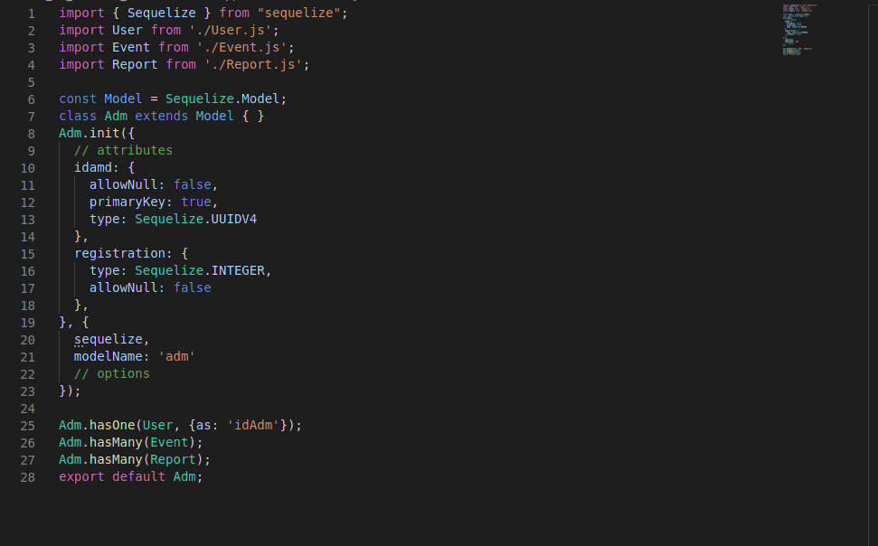
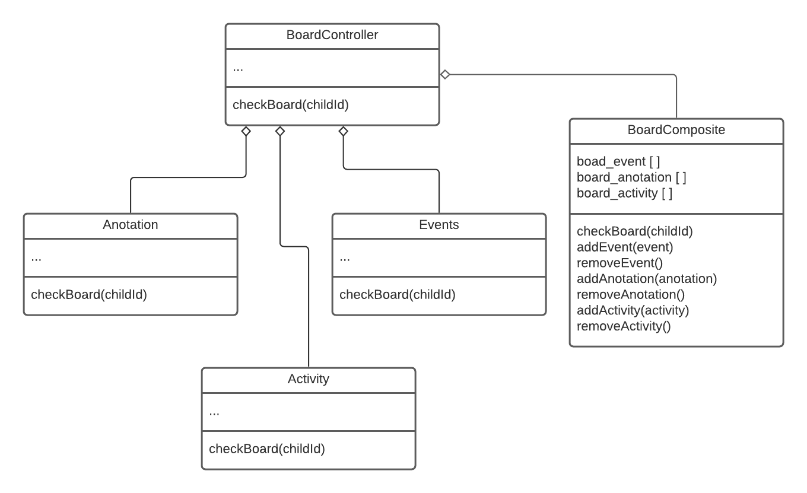
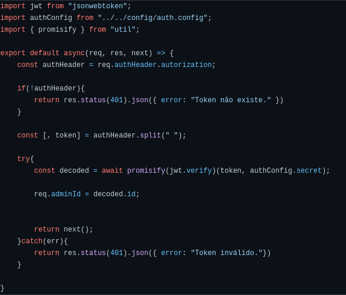

# GOFs Estruturais
 
## Adapter
 
&emsp;&emsp;Adapter é um padrão de projeto, que tem como objetivo converter a interface de uma classe em outra interface para o cliente. Os Adapters permitem que classes trabalhem juntas, mesmo que estejam em interfaces incompatíveis.[[1]](#bibliografia)
 
&emsp;&emsp;Alguns problemas que o Adapter pode solucionar:
 
 
- Reutilização de interfaces;
- Incompatibilidade de interfaces;

&emsp;&emsp;No contexto do nosso projeto, temos um exemplo de Adapter nas models da nossa aplicação, que é criada a partir da biblioteca sequelize do nodejs, e essas models funcionam como uma ponte entre o banco de dados e o app. Com isso o app fica completamente independente de qual banco de dados será utilizado.
 
 

[Figura 1: Exemplo de Adapter - Adm](../assets/imagens/gofs-adapters/adapters-model-adm.png)

 

[Figura 2: Exemplo de Adapter - Adm](../assets/imagens/gofs-adapters/adapters-controller.png)

 
 
## Bridge
&emsp;&emsp;O Bridge é um padrão de projeto estrutural que permite que você divida uma classe grande ou um conjunto de classes intimamente ligadas em duas hierarquias separadas: **Abstração** e **Implementação** que podem ser desenvolvidas independentemente umas das outras.
&emsp;&emsp;De acordo com o GoF[[1]](#bibliografia), o padrão Bridge significa desacoplar uma abstração de sua implementação para que as duas possam variar independentemente.
#### Abstração
&emsp;&emsp;Também chamado de interface é uma camada de controle de alto nível para alguma entidade. Essa camada não deve fazer nenhum tipo de trabalho por conta própria. Ela deve delegar o trabalho para a camada de implementação.
#### Implementação
&emsp;&emsp;Camada de que terá a responsabilidade de implementar um comportamento específico de um objeto.
 
 
## Composite
 
&emsp;&emsp;O Composite é um padrão de design de particionamento e descreve um grupo de objetos que é tratado da mesma maneira que uma única instância do mesmo tipo de objeto. O objetivo de um Composite é agrupar objetos em estruturas de árvores para representar hierarquias parte-todo. Ele permite que você tenha uma estrutura de árvore e peça a cada folha da árvore que execute uma tarefa. "O Composite é baseado no Polimorfismo e fornece variações protegidas a um cliente então não sofre impacto se seus objetos relacionados forem atômicos ou compostos" (LARMAN, 2004).
 
O padrão Composite possui 4 participantes:
 
- Component: Uma interface ou classe base abstrata para os objetos na estrutura em árvore. Esta classe define o comportamento padrão para todos os objetos e comportamentos para acessar e gerenciar componentes filhos na árvore.
- Leaf: É uma classe que estende Component para representar folhas na estrutura de árvore que não tem nenhum filho.
- Composite: É uma classe que estende Component para representar nós na estrutura da árvore, podendo conter filhos. Esta classe armazena componentes Leaf e implementa os comportamentos definidos em Component para acessar e gerenciar componentes filhos.
- Client: interage com o Component para acessar e manipular objetos na composição.
 
&emsp;&emsp;Em nosso projeto, é possível utilizar o Composite para gerar o [mural](../../../base/requisitos/modelagem/lexicos/#lexico-mural), onde teremos BoardController sendo o Component, e as leaf sendo a classe Events, a classe Anotations e a classe Activity. Abaixo temos um exemplo em javascript:
 

 

[Figura 3: Board Composite Code](../../assets/imagens/gofs/composite-code.png)

 
&emsp;&emsp;Em nível de modelagem, temos esse exemplo onde só foram descritos os métodos e atributos específicos utilizados no composite. É possível ver as classes mais completas no [Diagrama de classes](../modelagem/modelagem-estatica/diagrama-de-classes.md) do projeto.
 

 

[Figura 4: Composite](../../assets/imagens/gofs/CompositeModelagem.png)

 
## Proxy
&emsp;&emsp; O proxy é um padrão que tem intenção de fornecer um substituto de localização para outro objeto, com o objetivo de controlar esse objeto. Essa é a descrição que está na literatura de design patterns, mas de forma mais simplificada seria, o proxy é algo que fica no meio do caminho entre a chamada do objeto e o próprio objeto.
 

 

[Figura 5: Proxy](../../assets/imagens/gofs/proxy.png)

 
 
&emsp;&emsp; Quais as principais características  de um proxy?
 
* O objeto proxy finge ser o objeto real.
* É usado para controle de acesso, logs, cache, lazy instantiation, lazy evaluation, distribuição de serviços.
* Pode escolher como e quando repassar chamadas de método para o objeto real.
 
 
 
&emsp;&emsp; Além dessas características existe uma variação de proxy, abaixo iremos listar algumas delas.
* **Proxy Virtual:** Controla acesso a recursos que podem ser pesados para criação e utilização.
* **Proxy Remoto:** Faz o controle de recursos que se encontram remotamente.
* **Proxy de Proteção:** Faz o controle de autenticação  e permissão para recursos que precisem de tal.
&emsp;&emsp; Na aplicação do curumim usamos a variação de **Proxy de Proteção**, que como já foi dito, é responsável pelo processo de autenticação, como podemos observar na imagem do código abaixo.
 

[Figura 6: Proxy](../../assets/imagens/gofs/proxy-code.png)

## Facade
&emsp;&emsp; Tem como objetivo fornecer uma interface unificada para um conjunto de interface de nível mais alto em um subsistema. Vale ressaltar que o Facade não tem a intenção de esconder ou ocultar nada do código cliente, o objetivo é facilitar o uso do sistema.
 
&emsp;&emsp; Depois de algumas análises foi decidido que esse padrão não vai ser aplicado, visto que no uso desse padrão é bem comum ser criada **God Classes**(Uma classe que faz tudo), quebrando outros padrões, principalmente o princípio da responsabilidade única.

## Flyweight

&emsp;&emsp; O padrão flyweight tem como objetivo de compartilhar com eficiência grande quantidades  de objetos, assim sanando alguns problemas de poder computacional, visto que ele economiza memória RAM quando existem grandes números de objetos na aplicação.
 
&emsp;&emsp; Esse padrão não se aplica ao projeto curumim, visto que ele é recomendado quando existe uma grande quantidade de objetos, e assim ter problema com alto consumo de memória RAM.

## Bibliografia
 
> - LARMAN, Craig. <b>Utilizando UML e Padrões</b>: Uma introdução à análise e ao projeto orientados a objetos e ao desenvolvimento iterativo. 3. ed. [S. l.: s. n.], 2004.
 
 
> - Composite Design Pattern. Geeks For Geeks Disponível em: <https://www.geeksforgeeks.org/composite-design-pattern/>. Acesso em: 10 de setembro de 2021.
 
> - ERICH, Gamma. <b>Padrões de projeto</b>:  soluções reutilizáveis de softwareorientado a objetos. Ed. Única 2000.
 
> - The GoF Design Patterns Reference. Disponível em: [http://www.w3sdesign.com/](http://www.w3sdesign.com/)
 
> - [1] GoF, Design Patters - Elements of Reusable Object-Oriented Software. Disponível em: [http://www.uml.org.cn/c%2B%2B/pdf/DesignPatterns.pdf](http://www.uml.org.cn/c%2B%2B/pdf/DesignPatterns.pdf). Acesso em: 14 set. de 2021.
 
 
## Versionamento
| Versão | Data | Modificação | Autor |
|--|--|--|--|
|1.0|10/09/2021| Abertura do documento | João Pedro |
|1.1|10/09/2021| Adicionando topico Composite | João Pedro, Eliseu Kadesh |
|1.2|13/09/2021| Adicionando topico Proxy|Francisco Ferreira|
|1.3|13/09/2021| Adicão do Adapter | Eliseu Kadesh 
|1.4|20/09/2021| Adicionando topico Flyweight e Facade |Francisco Ferreira|
|1.5|20/09/2021| Revisão do Flyweight e Facade |Edson Soares e Eliseu Kadesh |
|1.1|10/09/2021| Adicionando tópico Composite | João Pedro, Eliseu Kadesh |
|1.2|13/09/2021| Adicionando tópico Proxy | Francisco Ferreira|
|1.3|13/09/2021| Adicão do Adapter | Eliseu Kadesh
|1.4|20/09/2021| Revisão GoFs Estruturais | Mateus Oliveira, Nilo Mendonça |

