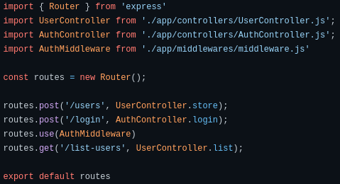
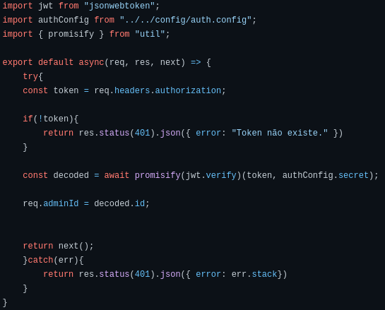
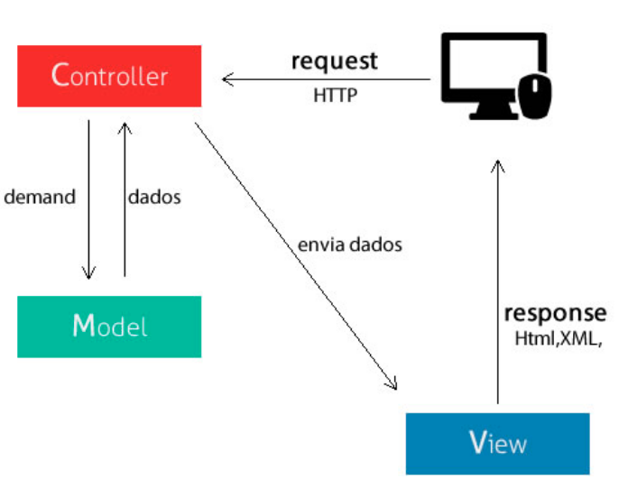

# Padrões Emergentes

## Padrão Midleware

### O que é midleware?

&emsp;&emsp;O middleware é representado por uma pipeline de processamentos onde existem funções pré-definidas que são as handlers, units e filters. Essa funções são conectadas entre si, assim gerando processamentos assíncronos que permite que essa funções façam um pré-processamento de qualquer um dos tipo de dados, podemos na [Figura 1](../assets/imagens/padroes-emergentes/middleware-manage.png).

 

[Figura 1 : Exemplo do middleware](../assets/imagens/padroes-emergentes/middleware-manage.png)

### Aplicação do midleware no Curumim

&emsp;&emsp; Nossa aplicação usa uma biblioteca bem conhecida no mundo do node.js, que é o express, que ele trata as requisições de maneira mais simples. Por padrão o middleware já vem implementado no express, se tratando de intercepting filter pattern do chain of responsibility.

 
 
 

[Figura 2 : Exemplo do uso express para requições](../assets/imagens/padroes-emergentes/express1.png)

 
 

[Figura 3 : Middle sendo usado para autenticação de usuário](../assets/imagens/padroes-emergentes/mvc.png)

## Padrão MVC

### O que é MVC?

&emsp;&emsp;O mvc é um dos padroẽs arquiteturais mais famosos no mundo de desenvolvimento web, visto pela sua simplicidade organizacional, assim trazendo mais eficiência e otimização no tempo de velocidade feita em requisições pelo usuário. Com quase 5 décadas de formulação a arquitetura mvc é é basicamente dividida em 3 camadas, Model, View e Controller.

 * Model: Essa camada também é conhecida como business object model, ela é a principal responsável pela leitura e escrita de dados e principalmente pela validações. 

 * View: Essa camada que mais próxima do usuário, é a camada que ele se interage e recebe informações de forma visual.

 * Controller: A controller é responsável por fazer o intermédio das requisições da view com as respostas da model.

 
 

[Figura 4 : MVC](../assets/imagens/padroes-emergentes/mvc.png)

### Aplicação do MVC no Curumim

&emsp;&emsp;Para o projeto Curumim foi adaptado o padrão MVC, essa decisão foi tomada por se tratar de um padrão de API REST, pesando nisso o grupo optou por separar a camada de view dentre a outras, assim a View é determinada pelo no client que faz essa renderização para o usuário da aplicação.

 

[Figura 5: Organização das pastas da API](../assets/imagens/padroes-emergentes/mc.png)

 

[Figura 6: Exemplo da model User](../assets/imagens/padroes-emergentes/model.png)

 

[Figura 7: Exemplo da controller](../assets/imagens/padroes-emergentes/controller.png)

## Bibliografia

> - Zucher, Vitor. O que é padrão MVC? Entenda arquitetura de softwares!.Publicado em 17/07/2020. Disponível em: https://www.lewagon.com/pt-BR/blog/o-que-e-padrao-mvc. Acessado em 19/09/2021.

> - Ramos, Allan. O que é MVC?. Publicado em 26/02/2015. https://tableless.com.br/mvc-afinal-e-o-que/. Acessado em 19/09/2021.

> - Grupo Unigrade. Padrões Emergentes: API. Matéria de Arquitetura e Desenho de Software, 2019. Disponível em: https://ads-unigrade-2019-1.github.io/Wiki/dinamica05B/api/. Acesso em: 20/09/2021.

> - NETO, Waldemar. Entendendo o Middleware pattern em Node.js. 11 de Setembro de 2017. Disponível em: https://walde.co/2017/09/11/entendendo-o-middleware-pattern-em-node-js/. Acesso em: 20/09/2021.

## Versionamento

| Versão | Data | Modificação | Autor |
|--|--|--|--|
|1.0|20/09/2021| Abertura do documento | Francisco |
| 1.1| 20/09/2021| Adicionando imagens | Francisco |
| 1.2| 20/09/2021| Adicionado padrão MVC | Bruno Felix e Francisco Ferreira |
| 1.3| 20/09/2021| Adicionado padrão middleware | Bruno Felix e Francisco Ferreira |
